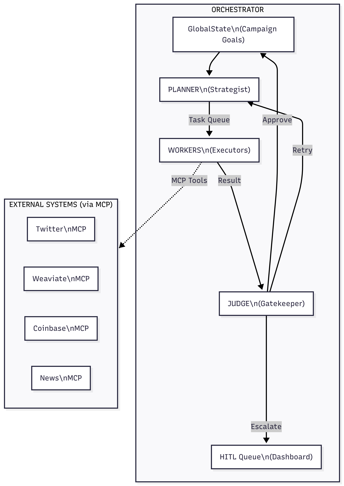

# Project Chimera — Day 1 Report

**Role:** Forward Deployed Engineer (FDE) Trainee  
**Mission:** Architect the "Factory" that builds the "Autonomous Influencer"  
**Date:** February 4, 2026

---

## Executive Summary

This report presents the research synthesis and architectural strategy for
Project Chimera, an Autonomous Influencer Network designed to create, govern,
and scale AI-powered digital entities capable of content creation, audience
engagement, and economic agency.

The research phase analyzed the emerging AI software stack, agent social
networks (OpenClaw, MoltBook), and the Project Chimera SRS to establish a
foundation for spec-driven development. The architectural decisions prioritize
governance, scalability, and safety through a hierarchical swarm pattern with
explicit human oversight.

---

## Part A: Research Summary

### Key Insights from Reading Materials

#### 1. The Trillion Dollar AI Code Stack (a16z)

| Insight | Implication for Chimera |
|---------|------------------------|
| AI systems are becoming **software factories**, not assistants | Chimera must be infrastructure, not a chatbot |
| Durability comes from **orchestration and verification layers** | Invest in governance, not just prompts |
| The stack is shifting from model-centric to **infrastructure-centric** | Focus on MCP, queues, and observability |

**Key Takeaway:** The future of AI is not about better prompts—it's about
better engineering. Project Chimera succeeds by being a production system,
not a prototype.

#### 2. OpenClaw & The Agent Social Network

| Insight | Implication for Chimera |
|---------|------------------------|
| Agents already interact in **shared environments** | Agent-to-agent protocols are operational, not theoretical |
| Security risks (prompt injection) remain **unresolved** | Governance must be architectural, not optional |
| Trust boundaries between agents are **critical** | External messages must pass validation layers |

**Key Takeaway:** OpenClaw demonstrates that agent ecosystems exist, but they
are fragile. Chimera must be a *governed participant*, not an open peer.

#### 3. MoltBook: Social Media for Bots

| Insight | Implication for Chimera |
|---------|------------------------|
| "Skills" function as **executable social contracts** | Chimera skills must define both capability and constraint |
| Agents participate via **instruction bundles** | Persona and behavior are configuration, not code |
| Interoperability > Optimization | Shared protocols matter more than individual performance |

**Key Takeaway:** MoltBook shows that agent behavior is best governed through
explicit skill definitions—capability packages that encode what an agent can
do and how it must behave.

#### 4. Project Chimera SRS Document

| Insight | Implication for Chimera |
|---------|------------------------|
| **FastRender Swarm** pattern (Planner-Worker-Judge) | Adopt hierarchical multi-agent architecture |
| **MCP** as universal interface | All external interactions via standardized protocol |
| **Agentic Commerce** via Coinbase AgentKit | Agents have wallets and economic agency |
| **HITL** with confidence-based routing | Human oversight is dynamic, not blocking |

**Key Takeaway:** The SRS defines Chimera not as a single agent, but as a
*factory* that produces governed, economically-enabled autonomous entities.

### Cross-Cutting Themes

1. **Spec-Driven Development is Mandatory**  
   Ambiguity causes hallucination. Explicit specifications are the only way to
   control autonomous behavior at scale.

2. **Governance is a First-Class Architectural Concern**  
   Safety cannot be bolted on. The Judge role, HITL routing, and budget
   governors must be structural primitives.

3. **Infrastructure > Intelligence**  
   The most reliable agent systems prioritize orchestration, verification, and
   explicit interfaces over raw model capability.

4. **Agent Social Networks Require Protocols**  
   Identity signaling, trust boundaries, and escalation paths are protocol
   problems, not prompting problems.

---

## Part B: Architectural Approach

### Agent Pattern: Hierarchical Swarm (FastRender)

**Decision:** Project Chimera adopts the **FastRender Swarm Architecture**—a
hierarchical, role-based multi-agent pattern with three specialized roles.

| Role | Responsibility | Key Property |
|------|----------------|--------------|
| **Planner** | Decompose goals into tasks, monitor state, re-plan dynamically | Stateful, strategic |
| **Worker** | Execute single atomic task using MCP Tools | Stateless, parallelizable |
| **Judge** | Validate output, enforce governance, route to HITL | Gatekeeping, quality control |

**Why This Pattern?**

| Criterion | Sequential Chain | Hierarchical Swarm | Winner |
|-----------|------------------|-------------------|--------|
| Parallelism | Low | High (N workers) | Swarm |
| Error Recovery | Cascading | Isolated | Swarm |
| Governance | Implicit | Explicit (Judge) | Swarm |
| Throughput | Limited | Horizontally scalable | Swarm |

**Rationale:**
- Autonomous influencers must handle high-velocity interactions (50+ comments)
- The Judge provides explicit quality and safety gates
- Worker failures are isolated; the Planner retries without cascade
- Pattern aligns with OpenClaw's need for predictable, governed behavior

### Architecture Diagram

### Human-in-the-Loop Strategy

**Decision:** Confidence-based dynamic routing with sensitive topic override.

| Confidence | Action | Latency |
|------------|--------|---------|
| > 0.90 | Auto-approve | Real-time |
| 0.70 – 0.90 | Async human review | Delayed |
| < 0.70 | Auto-reject + retry | Real-time |

**Sensitive Topics (Always HITL):** Politics, health advice, financial claims,
legal statements, crisis situations.

**Why?** This balances velocity with safety. High-confidence routine tasks
proceed without bottleneck; uncertain or sensitive content receives oversight.

### Database Strategy

**Decision:** Hybrid persistence layer.

| Data Type | Technology | Rationale |
|-----------|------------|-----------|
| Semantic Memory | **Weaviate** | Vector search for RAG, persona memories |
| Transactional | **PostgreSQL** | ACID compliance, structured queries |
| Ephemeral Cache | **Redis** | Task queues, short-term memory |
| Financial Ledger | **On-chain** | Immutable transaction record |

**Why Hybrid (Not Pure SQL or NoSQL)?**
- Video metadata needs structured queries → PostgreSQL
- Agent memories need semantic search → Weaviate
- Task queues need sub-millisecond latency → Redis
- Financial auditability needs immutability → Blockchain

### MCP Integration

**Decision:** Hub-and-Spoke topology with standardized MCP servers.

All external interactions (social platforms, databases, wallets, media
generation) flow through MCP. This:
- Decouples agent logic from API implementation
- Enables platform changes without core rewrites
- Provides standardized logging and governance

### Key Infrastructure Decisions

| Decision | Choice | Confidence |
|----------|--------|------------|
| Agent Pattern | Hierarchical Swarm | High |
| Orchestration | Kubernetes + Docker | High |
| AI (Reasoning) | Gemini 3 Pro / Claude Opus 4.5 | High |
| AI (Routine) | Gemini Flash / Haiku 3.5 | High |
| External Interface | MCP Protocol | High |

---

## Conclusion

Project Chimera's architecture is designed for **governance at scale**. By
adopting the FastRender Swarm pattern, implementing confidence-based HITL, and
using a hybrid database strategy, the system can:

1. Handle high-velocity content creation and engagement
2. Maintain safety through explicit Judge and HITL layers
3. Scale horizontally without losing coherence
4. Participate safely in agent social networks (OpenClaw)

The next phase will translate these architectural decisions into executable
specifications using the GitHub Spec Kit framework.

---

## References

### Project Research Documents

- [research/research_summary.md](https://github.com/gufite/chimera/blob/main/research/research_summary.md) — Full research synthesis
- [research/analysis.md](https://github.com/gufite/chimera/blob/main/research/analysis.md) — Agent social network analysis
- [research/architecture_strategy.md](https://github.com/gufite/chimera/blob/main/research/architecture_strategy.md) — Detailed architecture document

### External Reading Materials

- [The Trillion Dollar AI Code Stack](https://a16z.com/the-trillion-dollar-ai-code-stack/) — a16z analysis of AI infrastructure
- [OpenClaw Ecosystem](https://permiso.io/blog/inside-the-openclaw-ecosystem-ai-agents-with-privileged-credentials) — Agent social network security analysis
- [MoltBook: Social Media for Bots](https://github.com/OpenClaw/moltbook) — Agent interaction platform
- Project Chimera SRS Document (provided internally)
