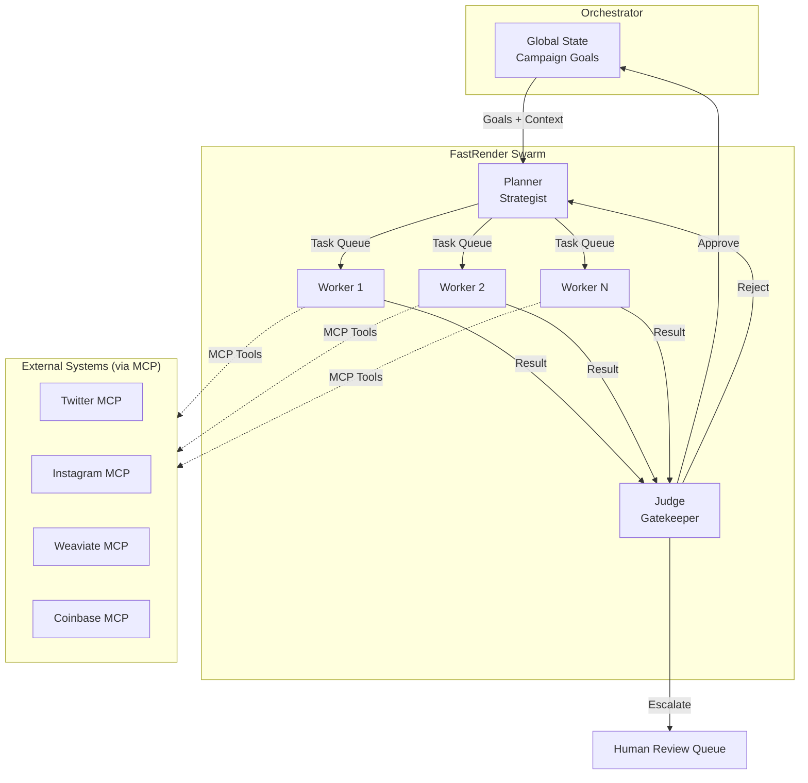
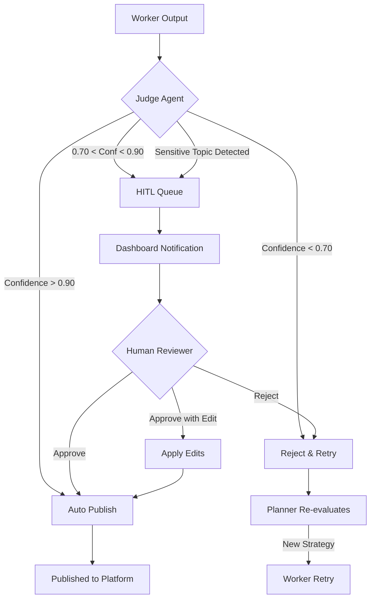
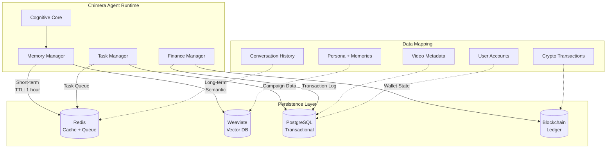
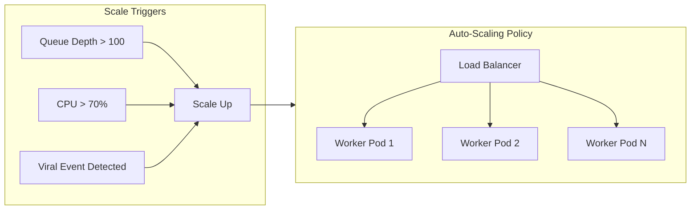
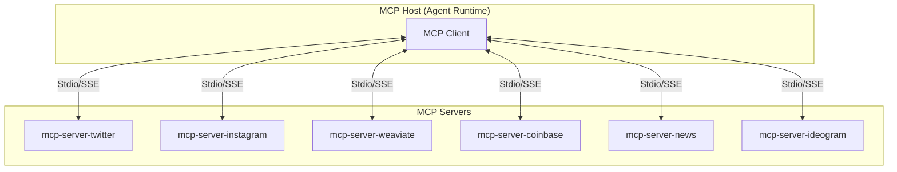

# Architecture Strategy — Project Chimera

This document defines the architectural decisions for Project Chimera, an
Autonomous Influencer Network. These decisions are informed by the research
synthesis (`research_summary.md`), ecosystem analysis (`analysis.md`), and the
Project Chimera SRS Document.

---

## 1. Agent Pattern Selection

### Decision: Hierarchical Swarm (FastRender Pattern)

Project Chimera adopts the **FastRender Swarm Architecture**, a hierarchical,
role-based multi-agent pattern that specializes agents into three distinct
roles: **Planner**, **Worker**, and **Judge**.

### Rationale

| Criterion | Sequential Chain | Hierarchical Swarm | Decision |
|-----------|------------------|-------------------|----------|
| Parallelism | Low (one-at-a-time) | High (N workers) | ✅ Swarm |
| Error Recovery | Cascading failures | Isolated failures | ✅ Swarm |
| Throughput | Limited | Horizontally scalable | ✅ Swarm |
| Complexity | Simple | Moderate | Trade-off |
| Governance | Implicit | Explicit (Judge layer) | ✅ Swarm |

The Swarm pattern is chosen because:

1. **Autonomous influencers require high throughput** — An agent may need to
   reply to 50 comments simultaneously. Sequential processing would be too slow.

2. **Governance is a first-class concern** — The Judge role provides an
   explicit quality and safety gate before any action is finalized.

3. **Failure isolation** — If one Worker fails (e.g., image generation timeout),
   it does not cascade to other tasks. The Planner simply retries.

4. **OpenClaw compatibility** — Agent social networks require predictable,
   governed behavior. The Swarm pattern enforces this structurally.

### Pattern Diagram



### Role Responsibilities

| Role | Responsibility | State | Scaling |
|------|----------------|-------|---------|
| **Planner** | Decompose goals into tasks, monitor GlobalState, dynamic re-planning | Stateful | 1 per campaign |
| **Worker** | Execute single atomic task using MCP Tools | Stateless | Horizontal (N) |
| **Judge** | Validate output, enforce governance, route to HITL | Stateful | 1-3 per swarm |

---

## 2. Human-in-the-Loop (HITL) Strategy

### Decision: Confidence-Based Dynamic Routing

The system implements a **probability-based HITL framework** where human
intervention is triggered dynamically based on the AI's self-assessed
confidence and content sensitivity.

### Confidence Thresholds

| Confidence Score | Action | Human Involvement | Latency |
|------------------|--------|-------------------|---------|
| **> 0.90** | Auto-Approve | None | Real-time |
| **0.70 – 0.90** | Async Approval | Queued for review | Delayed |
| **< 0.70** | Auto-Reject + Retry | None (automated) | Real-time |

### Sensitive Topic Override

Regardless of confidence score, the following topics **always require HITL**:

- Political content or commentary
- Health or medical advice
- Financial recommendations
- Legal claims or statements
- Content involving minors
- Crisis or emergency situations

### HITL Flow Diagram



### HITL Placement Summary

| Action Type | Default Mode | HITL Trigger |
|-------------|--------------|--------------|
| Trend-based content | Auto | Low confidence, sensitive topic |
| Reply to mentions | Auto | Negative sentiment, sensitive topic |
| Financial transactions | **Always HITL** | All transactions > $10 |
| New campaign launch | **Always HITL** | First 5 posts of any campaign |
| Crisis response | **Always HITL** | Any detected crisis keywords |

### Rationale

This approach balances **velocity with safety**:

- High-confidence routine tasks proceed without human bottleneck
- Sensitive or uncertain content receives human oversight
- The system learns from human corrections over time
- Operators can adjust thresholds per campaign or agent

---

## 3. Database Strategy

### Decision: Hybrid Persistence Layer

Project Chimera requires multiple data storage paradigms due to the diverse
nature of its data: semantic memories, transactional records, ephemeral state,
and immutable financial records.

### Database Selection Matrix

| Data Category | Technology | Justification |
|---------------|------------|---------------|
| **Semantic Memory** | Weaviate (Vector DB) | RAG-based retrieval, similarity search for persona and long-term memory |
| **Transactional Data** | PostgreSQL | ACID compliance, complex queries, user/campaign management |
| **Ephemeral Cache** | Redis | Sub-millisecond latency, TTL-based expiry, task queuing |
| **Financial Ledger** | On-chain (Base/Ethereum) | Immutable, auditable transaction record |

### SQL vs NoSQL Analysis

| Criterion | SQL (PostgreSQL) | NoSQL (MongoDB) | Vector (Weaviate) | Decision |
|-----------|------------------|-----------------|-------------------|----------|
| Video metadata storage | ✅ Structured | ✅ Flexible | ❌ Not suited | **PostgreSQL** |
| High-velocity writes | ⚠️ Moderate | ✅ Excellent | ⚠️ Moderate | Depends on use |
| Semantic search | ❌ Limited | ❌ Limited | ✅ Native | **Weaviate** |
| ACID transactions | ✅ Native | ⚠️ Limited | ❌ Not suited | **PostgreSQL** |
| Schema flexibility | ❌ Rigid | ✅ Flexible | ✅ Flexible | Trade-off |

**Conclusion:** Use PostgreSQL for structured video metadata (title, URL,
platform, timestamps, engagement metrics) and Weaviate for semantic content
(transcripts, topic embeddings, persona memories).

### Data Architecture Diagram



### Schema Highlights

#### PostgreSQL: Video Metadata

```sql
CREATE TABLE video_metadata (
    id UUID PRIMARY KEY DEFAULT gen_random_uuid(),
    agent_id UUID NOT NULL REFERENCES agents(id),
    platform VARCHAR(50) NOT NULL,
    external_id VARCHAR(255),
    title TEXT,
    description TEXT,
    url TEXT,
    thumbnail_url TEXT,
    duration_seconds INTEGER,
    view_count BIGINT DEFAULT 0,
    like_count BIGINT DEFAULT 0,
    comment_count BIGINT DEFAULT 0,
    published_at TIMESTAMP WITH TIME ZONE,
    created_at TIMESTAMP WITH TIME ZONE DEFAULT NOW(),
    updated_at TIMESTAMP WITH TIME ZONE DEFAULT NOW(),
    metadata JSONB
);

CREATE INDEX idx_video_agent ON video_metadata(agent_id);
CREATE INDEX idx_video_platform ON video_metadata(platform);
CREATE INDEX idx_video_published ON video_metadata(published_at DESC);
```

#### Weaviate: Agent Memory Collection

```json
{
  "class": "AgentMemory",
  "vectorizer": "text2vec-openai",
  "properties": [
    {"name": "agent_id", "dataType": ["string"]},
    {"name": "memory_type", "dataType": ["string"]},
    {"name": "content", "dataType": ["text"]},
    {"name": "context", "dataType": ["text"]},
    {"name": "importance_score", "dataType": ["number"]},
    {"name": "created_at", "dataType": ["date"]}
  ]
}
```

---

## 4. Infrastructure Strategy

### Compute Environment

| Component | Technology | Rationale |
|-----------|------------|-----------|
| Container Runtime | Docker | Standardized, reproducible environments |
| Orchestration | Kubernetes (K8s) | Auto-scaling, self-healing, rolling updates |
| Cloud Provider | AWS / GCP (Hybrid) | Flexibility, managed services |
| CI/CD | GitHub Actions | Native integration, free tier |

### AI Model Selection

| Task Category | Model | Rationale |
|---------------|-------|-----------|
| Planning & Judging | Gemini 3 Pro / Claude Opus 4.5 | High reasoning capability, complex decisions |
| Content Generation | Gemini 3 Pro / Claude Opus 4.5 | Creative, persona-consistent output |
| Filtering & Classification | Gemini 3 Flash / Haiku 3.5 | Low latency, cost-effective, high volume |
| Image Generation | Ideogram / Midjourney (via MCP) | High quality, character consistency |
| Video Generation | Runway / Luma (via MCP) | State-of-the-art video synthesis |

### Scaling Strategy



---

## 5. MCP Integration Architecture

### MCP Topology

Project Chimera uses a **Hub-and-Spoke** MCP topology where the Agent Runtime
acts as the MCP Host, connecting to specialized MCP Servers for external
capabilities.



### MCP Primitive Usage

| Primitive | Usage in Chimera |
|-----------|------------------|
| **Resources** | Perception — `twitter://mentions`, `news://trends` |
| **Tools** | Action — `post_tweet()`, `generate_image()`, `send_transaction()` |
| **Prompts** | Reasoning — `analyze_sentiment`, `extract_topics` |

---

## 6. Key Risks & Mitigations

| Risk | Impact | Probability | Mitigation |
|------|--------|-------------|------------|
| Runaway AI inference costs | High | Medium | Budget Governor ("CFO" sub-agent), per-task cost limits |
| Platform API changes | High | High | MCP abstraction layer isolates core logic |
| State race conditions | Medium | Medium | Optimistic Concurrency Control (OCC) in Judge |
| Prompt injection attacks | High | Medium | Trust boundary validation, input sanitization |
| Agent identity confusion | Medium | Low | Character consistency locks, SOUL.md governance |
| Wallet key compromise | Critical | Low | Hardware secrets manager, key rotation |

---

## 7. Decision Summary

| Decision Area | Choice | Confidence |
|---------------|--------|------------|
| Agent Pattern | Hierarchical Swarm (FastRender) | High |
| HITL Strategy | Confidence-based dynamic routing | High |
| Primary Database | PostgreSQL (transactional) | High |
| Vector Database | Weaviate (semantic memory) | High |
| Cache Layer | Redis (ephemeral + queues) | High |
| Compute | Kubernetes + Docker | High |
| MCP Topology | Hub-and-Spoke | High |

---

## 8. References

- Project Chimera SRS Document (Sections 3.1, 5.1, 2.3)
- `research/research_summary.md` — Key insights on spec-driven development
- `research/analysis.md` — Agent social network protocols
- FastRender Pattern — Cursor Agent Swarm Experiments
- Model Context Protocol — https://modelcontextprotocol.io
