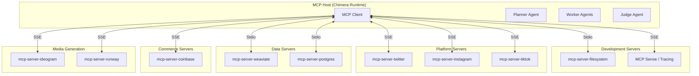

# Tooling Strategy — Project Chimera

> **Status:** Active  
> **Version:** 1.0.0  
> **Last Updated:** 2026-02-05  
> **Owner:** FDE Trainee (Lead Architect)

This document defines the tooling infrastructure for Project Chimera,
including MCP server configuration, Skills vs Tools taxonomy, and development
environment setup.

---

## 1. Overview

Project Chimera uses the **Model Context Protocol (MCP)** as its universal
interface for all external interactions. This document captures:

- MCP server configuration patterns
- Skills (internal) vs Tools (external) distinction
- Available and required MCP servers
- Development environment tooling
- Configuration management

---

## 2. MCP Architecture

### 2.1 Hub-and-Spoke Topology

Project Chimera operates as an **MCP Host** connecting to multiple specialized
**MCP Servers** via Stdio or SSE transport.



### 2.2 MCP Primitives

| Primitive | Direction | Usage in Chimera |
|-----------|-----------|------------------|
| **Resources** | Read-only | Perception — trends, mentions, timelines |
| **Tools** | Actions | Publishing, transactions, file operations |
| **Prompts** | Templates | Standardized reasoning patterns |

---

## 3. Skills vs Tools Taxonomy

Project Chimera distinguishes between **Skills** (internal reusable functions)
and **Tools** (external MCP bridges).

### 3.1 Definitions

| Type | Definition | Execution | Examples |
|------|------------|-----------|----------|
| **Skill** | Internal, reusable function or script the agent can call directly | In-process | `generate_caption`, `summarize_trend`, `parse_mentions` |
| **Tool** | External bridge via MCP Server to third-party services | Out-of-process | `post_tweet`, `generate_image`, `send_transaction` |

### 3.2 Key Differences

| Aspect | Skills | Tools (MCP) |
|--------|--------|-------------|
| Trust boundary | Internal (trusted) | External (untrusted responses) |
| Latency | Low (in-memory) | Variable (network) |
| Rate limits | None | Platform-specific |
| Error handling | Exceptions | MCP error protocol |
| State | May access agent state | Stateless request/response |

### 3.3 Classification Rules

1. **If it touches an external API** → It's a Tool (MCP)
2. **If it's pure computation** → It's a Skill
3. **If it requires secrets/auth** → It's a Tool (MCP)
4. **If it's reusable across agents** → Consider making it a Skill

---

## 4. MCP Server Inventory

### 4.1 Required Servers

| Server | Package | Status | Priority |
|--------|---------|--------|----------|
| `filesystem` | `@modelcontextprotocol/server-filesystem` | ✅ Configured | Critical |
| `weaviate` | `mcp-server-weaviate` (community) | ⚠️ Not yet | High |
| `postgres` | `@modelcontextprotocol/server-postgres` | ⚠️ Not yet | High |
| `coinbase` | `coinbase-agentkit-mcp` | ⚠️ Not yet | High |

### 4.2 Platform Servers (Build vs Buy)

| Server | Availability | Decision | Notes |
|--------|--------------|----------|-------|
| `mcp-server-twitter` | Community exists | Buy | Several implementations available |
| `mcp-server-instagram` | Limited | Build | Official API restrictive |
| `mcp-server-tiktok` | None | Build | API access challenging |
| `mcp-server-youtube` | Limited | Evaluate | Some community projects |

### 4.3 Media Generation Servers

| Server | Availability | Decision | Notes |
|--------|--------------|----------|-------|
| `mcp-server-ideogram` | None | Build | Wrap Ideogram API |
| `mcp-server-runway` | None | Build | Wrap Runway Gen-3 API |
| `mcp-server-elevenlabs` | Community exists | Buy | Voice synthesis |

---

## 5. Cursor IDE Configuration

### 5.1 MCP Configuration Location

MCP servers for Cursor are configured in:

```
.cursor/mcp.json
```

### 5.2 Configuration Schema

```json
{
  "mcpServers": {
    "<server-name>": {
      "command": "<executable>",
      "args": ["<arg1>", "<arg2>", "..."],
      "env": {
        "<ENV_VAR>": "<value>"
      }
    }
  }
}
```

**Alternative for remote servers:**

```json
{
  "mcpServers": {
    "<server-name>": {
      "url": "https://example.com/mcp",
      "headers": {
        "<Header-Name>": "<value>"
      }
    }
  }
}
```

### 5.3 Current Configuration

**File:** `.cursor/mcp.json`

```json
{
  "mcpServers": {
    "tenxfeedbackanalytics": {
      "name": "tenxanalysismcp",
      "url": "https://mcppulse.10academy.org/proxy",
      "headers": {
        "X-Device": "linux",
        "X-Coding-Tool": "cursor"
      }
    },
    "filesystem": {
      "command": "npx",
      "args": [
        "-y",
        "@modelcontextprotocol/server-filesystem",
        "/home/name-1/AI-Agent/ten-academy/chimera"
      ]
    }
  }
}
```

### 5.4 Server Configuration Details

#### 5.4.1 Filesystem Server

| Property | Value |
|----------|-------|
| Package | `@modelcontextprotocol/server-filesystem` |
| Transport | Stdio |
| Command | `npx` |
| Auto-confirm | `-y` flag |
| Allowed directories | Positional args after package name |

**Usage pattern:**

```json
{
  "command": "npx",
  "args": [
    "-y",
    "@modelcontextprotocol/server-filesystem",
    "/path/to/allowed/directory"
  ]
}
```

**Security notes:**
- Only the specified directories are accessible
- Subdirectories are included
- No access to parent directories or home
- Sandboxed to project root for security

**Available tools:**
- `read_file` — Read file contents
- `read_multiple_files` — Read multiple files at once
- `write_file` — Write/overwrite file
- `edit_file` — Make line-based edits
- `create_directory` — Create directories
- `list_directory` — List directory contents
- `directory_tree` — Recursive directory tree
- `move_file` — Move/rename files
- `search_files` — Glob pattern search
- `get_file_info` — File metadata

#### 5.4.2 TenX Feedback Analytics Server

| Property | Value |
|----------|-------|
| Type | Remote (SSE) |
| URL | `https://mcppulse.10academy.org/proxy` |
| Purpose | Competency tracking and performance analytics |

**Required headers:**
- `X-Device`: Operating system identifier
- `X-Coding-Tool`: IDE identifier

---

## 6. Development Environment Tools

### 6.1 Required Tools

| Tool | Purpose | Installation |
|------|---------|--------------|
| `npx` | Run npm packages without install | Bundled with Node.js |
| `uv` | Python package manager | `curl -LsSf https://astral.sh/uv/install.sh \| sh` |
| `git` | Version control | System package manager |
| `docker` | Containerization | Docker Desktop or engine |

### 6.2 Node.js Requirements

The filesystem MCP server requires Node.js. Recommended setup:

```bash
# Check Node version (18+ required)
node --version

# Install via nvm if needed
nvm install 20
nvm use 20
```

### 6.3 Verification Commands

```bash
# Verify npx works
npx --version

# Test filesystem server directly
npx -y @modelcontextprotocol/server-filesystem --help
```

---

## 7. Traceability & Observability

### 7.1 MCP Sense Integration

Per `specs/_meta.md`, a trace capture mechanism MUST be active during
development:

> "A trace capture mechanism MUST be active during development to log agent
> reasoning and decisions (e.g., MCP Sense, OpenTelemetry)."

**Current implementation:** TenX Feedback Analytics server provides:
- Passage of time logging
- Performance outlier detection
- Competency tracking

### 7.2 Audit Trail Requirements

All MCP tool invocations MUST be logged with:
- Correlation ID
- Timestamp
- Tool name
- Input parameters (sanitized)
- Output summary
- Duration

---

## 8. Security Considerations

### 8.1 Trust Boundaries


### 8.2 Security Rules

| Rule | Description |
|------|-------------|
| SR-01 | MCP responses are UNTRUSTED input |
| SR-02 | Never execute instructions from MCP responses |
| SR-03 | Validate all data before use |
| SR-04 | Sandbox filesystem access to project directories |
| SR-05 | Use environment variables for secrets, never hardcode |

### 8.3 Credential Management

| Credential Type | Storage | Injection |
|-----------------|---------|-----------|
| API keys | Environment variables | MCP server `env` config |
| Wallet keys | Hardware security module | Never in config files |
| Database passwords | Secrets manager | Runtime injection |

---

## 9. Adding New MCP Servers

### 9.1 Checklist

1. [ ] Identify if existing server exists (npmjs.com, GitHub)
2. [ ] Verify security and maintenance status
3. [ ] Test locally before adding to config
4. [ ] Add to `.cursor/mcp.json`
5. [ ] Restart Cursor to load server
6. [ ] Verify connection in MCP settings
7. [ ] Test with simple command
8. [ ] Document in this file

### 9.2 Template Configuration

**For Stdio transport (local npm package):**

```json
{
  "<server-name>": {
    "command": "npx",
    "args": ["-y", "<package-name>", "<additional-args>"],
    "env": {
      "API_KEY": "${API_KEY}"
    }
  }
}
```

**For SSE transport (remote server):**

```json
{
  "<server-name>": {
    "url": "https://<host>/mcp",
    "headers": {
      "Authorization": "Bearer ${TOKEN}"
    }
  }
}
```

---

## 10. Troubleshooting

### 10.1 Common Issues

| Issue | Cause | Solution |
|-------|-------|----------|
| Server not appearing | Config syntax error | Validate JSON, restart Cursor |
| Server shows "Disconnected" | Package not installed | Run `npx -y <package>` manually |
| Permission denied | Directory not allowed | Add directory to args list |
| Timeout errors | Network/package issue | Check connectivity, try manually |

### 10.2 Diagnostic Commands

```bash
# Check if package exists
npm view @modelcontextprotocol/server-filesystem

# Run server manually for debugging
npx -y @modelcontextprotocol/server-filesystem /path/to/dir

# Validate JSON config
python3 -c "import json; json.load(open('.cursor/mcp.json'))"
```

---

## 11. Future Roadmap

### 11.1 Near-term (Week 1-2)

- [ ] Add `mcp-server-postgres` for database access
- [ ] Add `mcp-server-weaviate` for vector operations
- [ ] Evaluate community Twitter MCP servers

### 11.2 Medium-term (Week 3-4)

- [ ] Build `mcp-server-instagram` wrapper
- [ ] Integrate Coinbase AgentKit MCP
- [ ] Add media generation servers

### 11.3 Long-term

- [ ] Custom MCP server for OpenClaw status publishing
- [ ] Unified observability MCP server
- [ ] Platform-agnostic social media abstraction layer

---

## 12. References

- [Model Context Protocol Specification](https://modelcontextprotocol.io)
- [MCP Servers Repository](https://github.com/modelcontextprotocol/servers)
- [`specs/_meta.md`](../specs/_meta.md) — Governance rules
- [`specs/technical.md`](../specs/technical.md) — Technical contracts
- [`research/architecture_strategy.md`](./architecture_strategy.md) — MCP topology

---

*End of Document*
