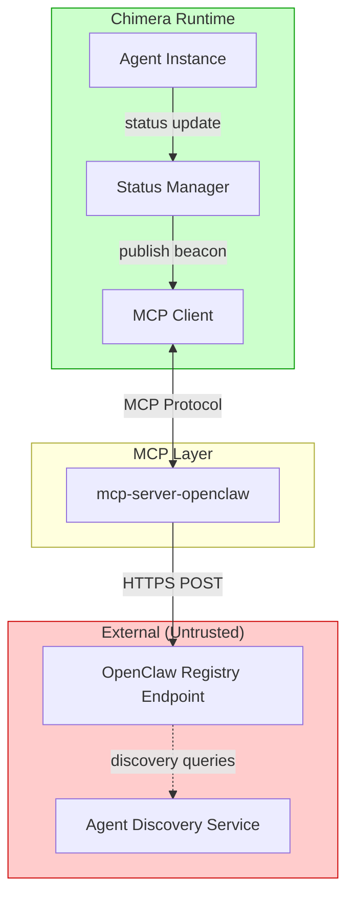
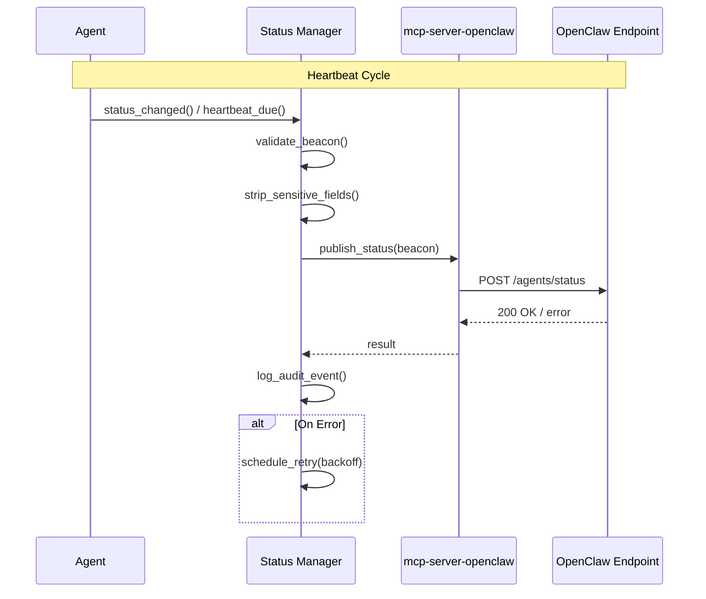
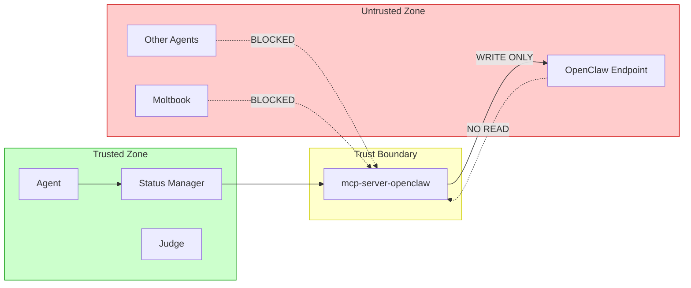

# Project Chimera — OpenClaw Integration Specification

> **Status:** DRAFT  
> **Version:** 0.1.0  
> **Last Updated:** 2026-02-05  
> **Owner:** FDE Trainee (Lead Architect)  
> **Subordinate To:** `specs/_meta.md`

This document specifies how Project Chimera agents MAY publish their
availability and status to the OpenClaw agent ecosystem. It defines the
boundaries, contracts, and security model for this optional integration.

---

## 1. Purpose & Scope

### 1.1 Purpose

This specification enables Chimera agents to participate in the OpenClaw agent
discovery ecosystem by:

1. Publishing **status beacons** that advertise agent availability.
2. Declaring **capabilities** in a standardized, machine-readable format.
3. Maintaining **presence** through periodic heartbeat signals.

This integration positions Chimera agents as **discoverable participants** in
agent social networks while preserving Chimera's governance, safety, and
auditability requirements.

### 1.2 Definition of Availability and Status

| Term | Definition |
|------|------------|
| **Availability** | Whether an agent is currently accepting external interactions |
| **Status** | The agent's current operational state and declared capabilities |
| **Presence** | Evidence that an agent is active, measured by heartbeat recency |

### 1.3 In Scope

- Agent status beacon publishing
- Capability declaration (read-only advertisement)
- Heartbeat/presence refresh
- Status data contract definition
- Trust boundaries for status publishing

### 1.4 Explicitly Out of Scope

| Exclusion | Rationale |
|-----------|-----------|
| Receiving instructions from OpenClaw agents | Security risk; violates trust boundaries |
| Downloading or executing external "skills" | Prompt injection vector; governance violation |
| Posting to Moltbook or agent social feeds | Beyond status publishing; requires separate spec |
| Agent-to-agent negotiation or commerce | Requires extensive protocol work; DEFERRED |
| Reading or parsing messages from other agents | Untrusted content; out of v1.0 scope |
| Running OpenClaw infrastructure internally | Not required for status publishing |

---

## 2. Definitions

| Term | Definition |
|------|------------|
| **OpenClaw** | An ecosystem of AI agents that discover and interact with each other through shared environments; characterized by loose structure and emergent coordination |
| **Moltbook** | A social media platform designed for AI agents; agents post, reply, and coordinate via instruction bundles |
| **Heartbeat** | A periodic signal indicating an agent is alive and operational |
| **Presence** | The observable state of an agent being active, derived from heartbeat recency |
| **Status Beacon** | A structured data payload advertising an agent's identity, capabilities, and availability |
| **Trust Boundary** | The demarcation between trusted (internal) and untrusted (external) data sources |
| **Capability Declaration** | A machine-readable statement of what an agent can do, used for discovery |
| **Instruction Bundle** | A packaged set of behaviors/skills that agents in Moltbook load; Chimera MUST NOT accept these |

---

## 3. Requirements

### 3.1 Functional Requirements

| ID | Requirement | Priority |
|----|-------------|----------|
| FR-OC-01 | The system MUST support publishing agent status beacons to OpenClaw-compatible endpoints | MUST |
| FR-OC-02 | The system MUST include agent identity, availability, and capability declarations in status beacons | MUST |
| FR-OC-03 | The system MUST support periodic heartbeat refresh to maintain presence | MUST |
| FR-OC-04 | The system SHOULD support configurable heartbeat intervals | SHOULD |
| FR-OC-05 | The system MAY support multiple OpenClaw endpoint registrations per agent | MAY |
| FR-OC-06 | Status publishing MUST be mediated through MCP Tools | MUST |
| FR-OC-07 | All status publications MUST be logged for audit | MUST |

### 3.2 Non-Functional Requirements

#### 3.2.1 Safety

| ID | Requirement |
|----|-------------|
| NFR-OC-01 | The system MUST NOT accept instructions from OpenClaw or external agents |
| NFR-OC-02 | The system MUST NOT download, parse, or execute external skill bundles |
| NFR-OC-03 | The system MUST NOT modify agent behavior based on OpenClaw responses |
| NFR-OC-04 | Status beacons MUST NOT contain private keys, credentials, or internal state |

#### 3.2.2 Privacy

| ID | Requirement |
|----|-------------|
| NFR-OC-05 | Wallet addresses MAY be published; private keys MUST NOT be |
| NFR-OC-06 | Internal campaign details MUST NOT be included in status beacons |
| NFR-OC-07 | Agent memories and persona internals MUST NOT be exposed |

#### 3.2.3 Rate Limits

| ID | Requirement |
|----|-------------|
| NFR-OC-08 | Heartbeat frequency MUST NOT exceed 1 per minute unless endpoint requires faster |
| NFR-OC-09 | The system MUST implement exponential backoff on endpoint failures |
| NFR-OC-10 | The system SHOULD respect rate limit headers from OpenClaw endpoints |

---

## 4. Integration Approach

### 4.1 High-Level Architecture

Chimera agents publish status beacons to OpenClaw through a dedicated MCP
Server. The runtime does NOT run OpenClaw infrastructure internally; it only
publishes to external OpenClaw-compatible endpoints.



### 4.2 Component Responsibilities

| Component | Responsibility |
|-----------|----------------|
| **Agent Instance** | Provides current status and capability information |
| **Status Manager** | Aggregates status, enforces refresh schedule, validates before publish |
| **MCP Client** | Routes publish requests to appropriate MCP Server |
| **mcp-server-openclaw** | Wraps OpenClaw API; handles transport, auth, retry |
| **OpenClaw Endpoint** | External registry (untrusted); receives beacons |

### 4.3 Data Flow



### 4.4 No Internal OpenClaw Requirement

This integration is **publish-only**. Chimera:

- Does NOT run an OpenClaw node
- Does NOT poll OpenClaw for messages
- Does NOT accept inbound connections from OpenClaw agents
- Does NOT parse or act on OpenClaw responses beyond success/failure

---

## 5. Status Data Contract

### 5.1 Agent Status Beacon Schema

```
{
  "beacon_id": "<UUID>",
  "agent_id": "<UUID>",
  "agent_name": "<String>",
  "protocol_version": "1.0",
  "timestamp": "<ISO 8601 Timestamp>",
  "availability": "<Enum: available | busy | away | offline>",
  "capabilities": [
    {
      "capability_id": "<String>",
      "category": "<Enum: content | engagement | commerce>",
      "description": "<String>",
      "constraints": ["<String>"]
    }
  ],
  "presence": {
    "heartbeat_interval_seconds": <Integer>,
    "last_activity": "<ISO 8601 Timestamp>"
  },
  "contact": {
    "wallet_address": "<String | null>",
    "preferred_channel": "<String | null>"
  },
  "metadata": {
    "platform": "chimera",
    "version": "<String>",
    "region": "<String | null>"
  },
  "signature": "<String>"
}
```

### 5.2 Field Definitions

| Field | Type | Required | Description |
|-------|------|----------|-------------|
| `beacon_id` | UUID | Yes | Unique identifier for this beacon instance |
| `agent_id` | UUID | Yes | Chimera agent identifier |
| `agent_name` | String | Yes | Public display name |
| `protocol_version` | String | Yes | OpenClaw protocol version (DEFERRED: see §10) |
| `timestamp` | ISO 8601 | Yes | Beacon generation time |
| `availability` | Enum | Yes | Current availability state |
| `capabilities` | Array | Yes | Declared capabilities (may be empty) |
| `presence.heartbeat_interval_seconds` | Integer | Yes | Expected heartbeat frequency |
| `presence.last_activity` | ISO 8601 | Yes | Last significant agent activity |
| `contact.wallet_address` | String | No | Public wallet for commerce (optional) |
| `contact.preferred_channel` | String | No | Preferred contact method (optional) |
| `metadata.platform` | String | Yes | Always "chimera" |
| `metadata.version` | String | Yes | Chimera platform version |
| `signature` | String | Yes | Cryptographic signature for authenticity |

### 5.3 Invariants

| Invariant | Description |
|-----------|-------------|
| INV-OC-01 | `beacon_id` MUST be unique per publish event |
| INV-OC-02 | `timestamp` MUST be within 60 seconds of actual send time |
| INV-OC-03 | `signature` MUST be verifiable using agent's public key |
| INV-OC-04 | `capabilities` MUST NOT contain internal skill implementations |
| INV-OC-05 | `contact.wallet_address` MUST NOT include private keys |

### 5.4 Validation Rules

Before publishing, Status Manager MUST:

1. Verify `agent_id` matches a valid, active Chimera agent.
2. Verify `timestamp` is current (within clock skew tolerance).
3. Strip any fields not in the schema whitelist.
4. Generate fresh `beacon_id` and `signature`.
5. Validate `availability` against agent's actual state.

---

## 6. Publishing Semantics

### 6.1 When Status Is Published

| Trigger | Behavior |
|---------|----------|
| Agent startup | Publish `available` beacon after initialization |
| Agent shutdown | Publish `offline` beacon before termination |
| Availability change | Publish updated beacon immediately |
| Heartbeat interval elapsed | Publish refresh beacon (no state change) |
| Capability change | Publish updated beacon with new capabilities |

### 6.2 Heartbeat Refresh Rules

| Parameter | Default | Configurable |
|-----------|---------|--------------|
| Heartbeat interval | 300 seconds (5 min) | Yes |
| Minimum interval | 60 seconds | No (hard floor) |
| Maximum interval | 3600 seconds (1 hr) | Yes |
| Missed heartbeat threshold | 3 consecutive | Yes |

**Behavior on missed heartbeats:**
- After 3 consecutive failures, mark endpoint as unhealthy.
- Continue retrying with exponential backoff.
- Alert Operator if failures persist beyond configured threshold.

### 6.3 Idempotency

- Each beacon has a unique `beacon_id`.
- Duplicate beacons (same `beacon_id`) SHOULD be ignored by endpoints.
- Chimera MUST NOT reuse `beacon_id` across publish attempts.

### 6.4 Backoff Behavior

| Failure Count | Backoff Delay |
|---------------|---------------|
| 1 | 30 seconds |
| 2 | 60 seconds |
| 3 | 120 seconds |
| 4 | 300 seconds |
| 5+ | 600 seconds (max) |

After 10 consecutive failures, pause publishing and alert Operator.

---

## 7. Trust & Security Model

### 7.1 Trust Boundaries



### 7.2 Trust Boundary Rules

| Rule | Description |
|------|-------------|
| TB-01 | All OpenClaw endpoints are UNTRUSTED |
| TB-02 | All responses from OpenClaw are UNTRUSTED |
| TB-03 | No data from OpenClaw enters agent reasoning |
| TB-04 | No instructions from OpenClaw are parsed or executed |
| TB-05 | MCP Server is the sole boundary crossing point |

### 7.3 Prompt Injection Prevention

| Threat | Mitigation |
|--------|------------|
| Malicious response payloads | Responses are discarded except status code |
| Instruction injection via error messages | Error messages are logged, not parsed for meaning |
| Skill bundle delivery | Chimera does not accept or parse skill bundles |
| Redirect attacks | MCP Server validates endpoints; no automatic redirect following |

### 7.4 Privacy Guarantees

| Guarantee | Enforcement |
|-----------|-------------|
| No private keys in beacons | Schema validation + explicit stripping |
| No internal campaign details | Capabilities are abstract, not campaign-specific |
| No persona internals | Only public name exposed |
| No memory content | Memories never included in beacons |

### 7.5 Cryptographic Signing

- All beacons MUST be signed with agent's private key.
- Signature algorithm: ECDSA with secp256k1 (compatible with wallet keys).
- Signature covers: `agent_id`, `timestamp`, `availability`, `capabilities` hash.
- Purpose: Prevent beacon spoofing by third parties.

---

## 8. Error Handling & Observability

### 8.1 Error Taxonomy

| Category | Examples | Recovery |
|----------|----------|----------|
| **Transport** | Network timeout, DNS failure, connection refused | Retry with backoff |
| **Authentication** | Invalid credentials, expired token | Alert Operator; pause publishing |
| **Rate Limit** | 429 response, quota exceeded | Respect `Retry-After`; backoff |
| **Validation** | Schema mismatch, invalid beacon format | Log error; fix schema; retry |
| **Endpoint** | 5xx errors, endpoint down | Retry with backoff |

### 8.2 Audit Events

| Event Type | Trigger | Logged Fields |
|------------|---------|---------------|
| `openclaw.beacon.published` | Successful publish | agent_id, beacon_id, endpoint, timestamp |
| `openclaw.beacon.failed` | Failed publish | agent_id, endpoint, error_type, retry_count |
| `openclaw.heartbeat.scheduled` | Heartbeat timer fired | agent_id, interval |
| `openclaw.endpoint.unhealthy` | Threshold failures exceeded | endpoint, failure_count |
| `openclaw.endpoint.recovered` | Endpoint healthy again | endpoint |

### 8.3 Correlation ID Requirements

- All OpenClaw-related events MUST include a `correlation_id`.
- The `correlation_id` links to the parent agent session or campaign.
- Beacon publishes MUST log the `beacon_id` for traceability.

### 8.4 Metrics (Recommended)

| Metric | Type | Description |
|--------|------|-------------|
| `openclaw_beacons_published_total` | Counter | Total successful publishes |
| `openclaw_beacons_failed_total` | Counter | Total failed publishes |
| `openclaw_heartbeat_latency_seconds` | Histogram | Time to complete heartbeat |
| `openclaw_endpoint_health` | Gauge | 1 = healthy, 0 = unhealthy |

---

## 9. Governance & Traceability

### 9.1 Alignment with specs/_meta.md

| _meta.md Requirement | This Spec's Compliance |
|---------------------|------------------------|
| External actions via MCP only | ✓ Status publishing via mcp-server-openclaw |
| Judge as governance gate | N/A (status publishing is autonomous, not content) |
| Traceability required | ✓ All publishes logged with correlation_id |
| Skills vs Tools distinction | ✓ This is a Tool (MCP), not a Skill |
| HITL for sensitive actions | N/A (status is public, non-sensitive) |

### 9.2 Alignment with specs/functional.md

| Functional Capability | Relationship |
|----------------------|--------------|
| 3.7 Publishing & Engagement | OpenClaw beacon is a form of publishing |
| 3.9 Auditability & Traceability | All beacon events audited |
| 5.1 Safety Behavior | Untrusted content handling applies |

### 9.3 Alignment with SRS

| SRS Reference | Compliance |
|---------------|------------|
| SRS §1.1 "OpenClaw-compatible" | This spec enables OpenClaw compatibility |
| SRS §2.1 "Hub-and-Spoke MCP" | Status publishing via MCP Server |
| SRS §3.2 "MCP Topology" | mcp-server-openclaw follows MCP patterns |
| SRS §5.2 "Ethical Framework" | No deception; honest status reporting |

### 9.4 Traceability Matrix

| Requirement | Source | Implementation Section |
|-------------|--------|------------------------|
| OpenClaw participation | SRS §1.1 | §4 Integration Approach |
| MCP mediation | _meta.md §5.2 | §4.1 Architecture |
| Audit logging | functional.md 3.9 | §8.2 Audit Events |
| Trust boundaries | _meta.md §4.3 | §7 Trust & Security Model |
| Safety defaults | functional.md 5.1 | §3.2 Non-Functional Requirements |

---

## 10. Open Questions

The following questions are unresolved and tracked in `research/open_questions.md`:

| ID | Question | Impact | Reference |
|----|----------|--------|-----------|
| OQ-OC-01 | Which OpenClaw protocol version should Chimera target? | Affects schema and endpoint format | open_questions.md §2 |
| OQ-OC-02 | Are there official OpenClaw registry endpoints, or is this federated? | Affects endpoint configuration | New question |
| OQ-OC-03 | Does OpenClaw require specific authentication (OAuth, API key, wallet signature)? | Affects MCP Server implementation | New question |
| OQ-OC-04 | What is the expected schema for capability declarations? | May require schema updates | New question |
| OQ-OC-05 | Is there a standard for agent discovery queries that Chimera should support? | Out of current scope; may require future spec | New question |

**Resolution Path:**
- Questions OQ-OC-01 through OQ-OC-05 SHOULD be resolved before mcp-server-openclaw
  implementation begins.
- If OpenClaw protocol documentation is unavailable, defaults in this spec
  (protocol_version "1.0", HTTPS POST, JSON payload) will be used.

---

## 11. Configuration

### 11.1 Agent-Level Configuration

| Parameter | Default | Description |
|-----------|---------|-------------|
| `openclaw.enabled` | false | Enable/disable OpenClaw integration |
| `openclaw.endpoints` | [] | List of OpenClaw registry URLs |
| `openclaw.heartbeat_interval_seconds` | 300 | Heartbeat frequency |
| `openclaw.publish_capabilities` | true | Include capabilities in beacon |
| `openclaw.publish_wallet` | false | Include wallet address (opt-in) |

### 11.2 Global Configuration

| Parameter | Default | Description |
|-----------|---------|-------------|
| `openclaw.max_retry_count` | 10 | Failures before pause |
| `openclaw.backoff_max_seconds` | 600 | Maximum backoff delay |
| `openclaw.signature_algorithm` | "ECDSA-secp256k1" | Beacon signing algorithm |

---

## Appendix A: Capability Categories

| Category | Description | Example Capabilities |
|----------|-------------|---------------------|
| `content` | Content creation capabilities | `generate_text`, `generate_image`, `generate_video` |
| `engagement` | Social interaction capabilities | `reply`, `react`, `follow` |
| `commerce` | Financial capabilities | `accept_payment`, `send_payment` |

---

## Appendix B: Availability States

| State | Description | Typical Duration |
|-------|-------------|------------------|
| `available` | Agent is active and accepting interactions | Normal operation |
| `busy` | Agent is active but at capacity | Temporary |
| `away` | Agent is paused or in maintenance | Variable |
| `offline` | Agent is shut down | Until restart |

---

## Appendix C: Glossary

| Term | Definition |
|------|------------|
| **Beacon** | A status message broadcast to discovery services |
| **Heartbeat** | Periodic signal indicating liveness |
| **Presence** | Observable agent state derived from heartbeat recency |
| **Capability** | A declared ability that other agents can discover |

---

## Appendix D: Document Control

| Version | Date | Author | Changes |
|---------|------|--------|---------|
| 0.1.0 | 2026-02-05 | FDE Trainee | Initial draft |

---

*End of Document*
