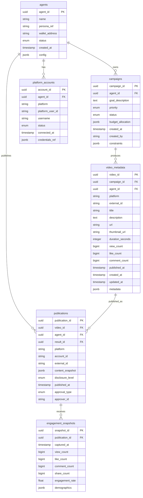

# Project Chimera — Technical Specification

> **Status:** DRAFT  
> **Version:** 0.2.0  
> **Last Updated:** 2026-02-05  
> **Owner:** FDE Trainee (Lead Architect)  
> **Subordinate To:** `specs/_meta.md`, `specs/functional.md`

This document defines the technical contracts, interfaces, invariants, and
operational semantics that implement the behaviors promised in
`specs/functional.md`. It does not contain implementation code; it defines the
boundaries and rules that implementations MUST follow.

---

## 1. Purpose & Scope

### 1.1 Purpose

This technical specification:

1. Defines **data contracts** for all canonical objects in the system.
2. Specifies **component contracts** for Planner, Worker, Judge, and HITL.
3. Establishes **integration contracts** for MCP Tools and Resources.
4. Documents **invariants** that implementations MUST preserve.
5. Provides **error taxonomy** and recovery semantics.

### 1.2 Scope

This document covers:
- Runtime component contracts and boundaries
- Data model contracts (conceptual, not DDL)
- MCP integration requirements
- Safety and trust boundaries
- Budget governance semantics
- Observability requirements

This document does NOT cover:
- Implementation code or pseudo-code
- Deployment topology or infrastructure sizing
- Vendor-specific configurations
- UI/UX design specifications

### 1.3 Relationship to Other Documents

| Document | Relationship |
|----------|--------------|
| `specs/_meta.md` | Constitutional authority; this document MUST NOT contradict |
| `specs/functional.md` | Defines WHAT; this document defines HOW to guarantee it |
| `research/architecture_strategy.md` | Informs patterns; this document formalizes contracts |
| `research/open_questions.md` | Deferred decisions; this document references but does not resolve |
| Project Chimera SRS | Requirements source; this document implements |

---

## 2. System Boundaries & Components

### 2.1 Core Runtime Components

| Component | Responsibility | State | Cardinality |
|-----------|----------------|-------|-------------|
| **Planner** | Goal decomposition, task scheduling, re-planning | Stateful | 1 per campaign |
| **Worker Pool** | Task execution via Skills + MCP Tools | Stateless | N (horizontal scale) |
| **Judge** | Validation, governance, HITL routing | Stateful | 1+ per swarm |
| **GlobalState** | Shared state repository (goals, context, config) | Persistent | 1 per deployment |
| **Task Queue** | Pending tasks awaiting Worker pickup | Persistent | 1 per deployment |
| **Review Queue** | Results awaiting Judge validation | Persistent | 1 per deployment |
| **HITL Queue** | Escalated items awaiting human review | Persistent | 1 per deployment |

### 2.2 MCP Host vs. MCP Servers

| Boundary | Description |
|----------|-------------|
| **MCP Host** | The Agent Runtime; runs MCP Client; aggregates capabilities from servers |
| **MCP Servers** | Independent processes wrapping external APIs; expose Tools/Resources/Prompts |

The Agent Runtime MUST act as MCP Host. All external system access MUST flow
through MCP Servers connected to this Host.

### 2.3 Human Interfaces

| Interface | Boundary Type |
|-----------|---------------|
| **Orchestrator Dashboard** | Read/write to GlobalState, Campaign management |
| **HITL Review Interface** | Read HITL Queue; write approval decisions |
| **Developer CLI/API** | Configuration, deployment, debugging |

Human interfaces are logical boundaries. They interact with the system through
defined APIs; they MUST NOT bypass the Judge for publication actions.

### 2.4 Forbidden Paths

The following paths are PROHIBITED:

| Forbidden Path | Reason |
|----------------|--------|
| Worker → External Platform API (direct) | Violates MCP mediation requirement |
| Worker → Publication (bypassing Judge) | Violates governance gate |
| Any component → GlobalState mutation (bypassing Judge commit) | Violates OCC and consistency |
| Any component → Untrusted instruction execution | Violates safety boundaries |
| Planner → External action execution | Planner plans; Workers execute |

---

## 3. Core Data Contracts

### 3.1 Agent

**Description:** A persistent autonomous entity with identity, persona, and wallet.

| Field | Type | Required | Description |
|-------|------|----------|-------------|
| `agent_id` | UUID | Yes | Unique identifier |
| `name` | String | Yes | Display name |
| `persona_ref` | Path | Yes | Reference to SOUL.md file |
| `wallet_address` | String | Yes | Non-custodial wallet address |
| `status` | Enum | Yes | `active`, `paused`, `suspended` |
| `created_at` | Timestamp | Yes | Creation time |
| `config` | Object | No | Agent-specific configuration overrides |

**Invariants:**
- `agent_id` MUST be immutable after creation.
- `persona_ref` MUST point to a valid, parseable SOUL.md file.
- `wallet_address` MUST be a valid address on the configured blockchain.

**System of Record:** Transactional store (relational).

---

### 3.2 Persona (SOUL.md Reference)

**Description:** The immutable identity definition for an agent.

| Field | Type | Required | Description |
|-------|------|----------|-------------|
| `name` | String | Yes | Persona name |
| `id` | String | Yes | Unique persona identifier |
| `backstory` | Text | Yes | Narrative history |
| `voice_traits` | List[String] | Yes | Stylistic guidelines |
| `directives` | List[String] | Yes | Hard behavioral constraints |
| `core_beliefs` | List[String] | No | Ethical guardrails |

**Invariants:**
- Persona content MUST be version-controlled.
- Changes to persona require explicit review process.
- `directives` are hard constraints; violations MUST be rejected by Judge.

**System of Record:** Version-controlled file system (Git).

---

### 3.3 Campaign

**Description:** A high-level goal or mission assigned to agents.

| Field | Type | Required | Description |
|-------|------|----------|-------------|
| `campaign_id` | UUID | Yes | Unique identifier |
| `goal_description` | Text | Yes | Natural language goal |
| `agent_ids` | List[UUID] | Yes | Assigned agents |
| `priority` | Enum | Yes | `high`, `medium`, `low` |
| `budget_allocation` | Object | No | Budget limits for this campaign |
| `status` | Enum | Yes | `active`, `paused`, `completed`, `cancelled` |
| `created_at` | Timestamp | Yes | Creation time |
| `created_by` | String | Yes | Operator identity |
| `constraints` | Object | No | Time limits, platform restrictions, etc. |

**Invariants:**
- At least one `agent_id` MUST be assigned.
- `status` transitions MUST be logged.
- Paused campaigns MUST NOT generate new tasks.

**System of Record:** Transactional store (relational).

---

### 3.4 Task

**Description:** An atomic unit of work assigned to a Worker.

| Field | Type | Required | Description |
|-------|------|----------|-------------|
| `task_id` | UUID | Yes | Unique identifier |
| `campaign_id` | UUID | Yes | Parent campaign |
| `task_type` | Enum | Yes | `generate_content`, `reply_comment`, `execute_transaction`, etc. |
| `priority` | Enum | Yes | `high`, `medium`, `low` |
| `status` | Enum | Yes | `pending`, `in_progress`, `review`, `complete`, `failed` |
| `context` | Object | Yes | Goal description, persona constraints, required resources |
| `acceptance_criteria` | List[String] | Yes | Conditions for success |
| `assigned_worker_id` | String | No | Worker currently executing (if any) |
| `created_at` | Timestamp | Yes | Creation time |
| `deadline` | Timestamp | No | Optional deadline |
| `retry_count` | Integer | Yes | Number of retry attempts |
| `max_retries` | Integer | Yes | Maximum allowed retries |

**Invariants:**
- `task_id` MUST be globally unique.
- `status` MUST transition through defined states only.
- `context` MUST include sufficient information for stateless execution.

**System of Record:** Transactional store (relational) + Task Queue (ephemeral).

---

### 3.5 Result Artifact

**Description:** Output produced by a Worker for Judge validation.

| Field | Type | Required | Description |
|-------|------|----------|-------------|
| `result_id` | UUID | Yes | Unique identifier |
| `task_id` | UUID | Yes | Originating task |
| `worker_id` | String | Yes | Executing worker |
| `artifact_type` | Enum | Yes | `content`, `transaction`, `engagement`, etc. |
| `content` | Object | Yes | The produced output (text, media refs, tx details) |
| `confidence_score` | Float | Yes | 0.0–1.0 quality/safety self-assessment |
| `tool_usage` | List[Object] | Yes | MCP Tools invoked with inputs/outputs |
| `provenance` | Object | Yes | Memory refs, signal refs, inputs used |
| `created_at` | Timestamp | Yes | Creation time |
| `execution_duration_ms` | Integer | Yes | Time taken |

**Invariants:**
- `confidence_score` MUST be between 0.0 and 1.0 inclusive.
- `tool_usage` MUST log every MCP Tool call.
- `provenance` MUST be sufficient for audit trail reconstruction.

**System of Record:** Review Queue (ephemeral) → Transactional store (after approval).

---

### 3.6 Review Item (HITL)

**Description:** An escalated result awaiting human review.

| Field | Type | Required | Description |
|-------|------|----------|-------------|
| `review_id` | UUID | Yes | Unique identifier |
| `result_id` | UUID | Yes | Associated result artifact |
| `escalation_reason` | Enum | Yes | `low_confidence`, `sensitive_topic`, `mandatory_hitl`, `anomaly` |
| `confidence_score` | Float | Yes | From result artifact |
| `reasoning_trace` | Text | Yes | Judge's reasoning for escalation |
| `context_snapshot` | Object | Yes | Goal, persona, recent history |
| `status` | Enum | Yes | `pending`, `approved`, `rejected`, `edited`, `deferred` |
| `created_at` | Timestamp | Yes | Escalation time |
| `reviewed_at` | Timestamp | No | Review completion time |
| `reviewer_id` | String | No | Reviewer identity |
| `reviewer_action` | Enum | No | `approve`, `approve_with_edit`, `reject`, `defer` |
| `edit_content` | Object | No | Modified content (if edited) |

**Invariants:**
- `reasoning_trace` MUST be provided for every escalation.
- `context_snapshot` MUST contain sufficient information for informed decision.
- All status transitions MUST be logged with timestamp and actor.

**System of Record:** HITL Queue (ephemeral) → Transactional store (after resolution).

---

### 3.7 Publication Record

**Description:** Record of content published to external platform.

| Field | Type | Required | Description |
|-------|------|----------|-------------|
| `publication_id` | UUID | Yes | Unique identifier |
| `result_id` | UUID | Yes | Source result artifact |
| `platform` | String | Yes | Target platform identifier |
| `account_id` | String | Yes | Platform account used |
| `external_id` | String | Yes | Platform-assigned post/content ID |
| `content_snapshot` | Object | Yes | Content as published |
| `disclosure_level` | Enum | Yes | `automated`, `assisted`, `none` |
| `published_at` | Timestamp | Yes | Publication time |
| `approval_type` | Enum | Yes | `auto`, `hitl` |
| `approver_id` | String | No | HITL reviewer (if applicable) |

**Invariants:**
- `external_id` MUST be obtained from platform response.
- `disclosure_level` MUST comply with platform AI labeling requirements.
- Publication MUST NOT occur without prior Judge approval.

**System of Record:** Transactional store (relational).

---

### 3.8 Engagement Action

**Description:** Record of engagement action (reply, like, repost).

| Field | Type | Required | Description |
|-------|------|----------|-------------|
| `engagement_id` | UUID | Yes | Unique identifier |
| `action_type` | Enum | Yes | `reply`, `like`, `repost`, `follow` |
| `target_id` | String | Yes | External content/user being engaged |
| `platform` | String | Yes | Platform identifier |
| `content` | Object | No | Reply content (if applicable) |
| `result_id` | UUID | Yes | Source result artifact |
| `executed_at` | Timestamp | Yes | Action time |

**Invariants:**
- Engagement actions MUST flow through Judge approval.
- Reply content MUST pass persona and safety validation.

**System of Record:** Transactional store (relational).

---

### 3.9 Memory Item

**Description:** Agent memory for context continuity.

| Subtype | Store | TTL | Description |
|---------|-------|-----|-------------|
| **Short-term (Episodic)** | Ephemeral cache | 1–24 hours | Recent conversation, immediate context |
| **Long-term (Semantic)** | Vector database | Permanent | Persona memories, significant interactions |

#### Short-term Memory Fields

| Field | Type | Required | Description |
|-------|------|----------|-------------|
| `memory_id` | UUID | Yes | Unique identifier |
| `agent_id` | UUID | Yes | Owning agent |
| `content` | Text | Yes | Memory content |
| `context_type` | Enum | Yes | `conversation`, `action`, `observation` |
| `created_at` | Timestamp | Yes | Creation time |
| `ttl_seconds` | Integer | Yes | Time-to-live |

#### Long-term Memory Fields

| Field | Type | Required | Description |
|-------|------|----------|-------------|
| `memory_id` | UUID | Yes | Unique identifier |
| `agent_id` | UUID | Yes | Owning agent |
| `memory_type` | Enum | Yes | `experience`, `fact`, `relationship` |
| `content` | Text | Yes | Memory content |
| `context` | Text | No | Surrounding context |
| `importance_score` | Float | Yes | 0.0–1.0 significance |
| `embedding` | Vector | Yes | Semantic embedding |
| `created_at` | Timestamp | Yes | Creation time |

**Invariants:**
- Short-term memory MUST expire after TTL.
- Long-term memory writes MUST be triggered by Judge approval of significant interactions.
- Memory isolation: Agent A MUST NOT access Agent B's memories.

**System of Record:**
- Short-term: Ephemeral cache (Redis or equivalent)
- Long-term: Vector database (Weaviate or equivalent)

---

### 3.10 Audit Event

**Description:** Immutable record of significant system event.

| Field | Type | Required | Description |
|-------|------|----------|-------------|
| `event_id` | UUID | Yes | Unique identifier |
| `correlation_id` | UUID | Yes | Links related events (campaign→task→result→publication) |
| `event_type` | Enum | Yes | See Event Taxonomy (§12) |
| `actor` | String | Yes | Component or human identity |
| `timestamp` | Timestamp | Yes | Event time |
| `payload` | Object | Yes | Event-specific data |
| `severity` | Enum | Yes | `info`, `warning`, `error`, `critical` |

**Invariants:**
- Audit events MUST be append-only (no updates or deletes).
- `correlation_id` MUST be propagated through the entire workflow chain.
- All events MUST include sufficient context for investigation.

**System of Record:** Append-only log store.

---

### 3.11 Budget Policy

**Description:** Cost governance configuration.

| Field | Type | Required | Description |
|-------|------|----------|-------------|
| `policy_id` | UUID | Yes | Unique identifier |
| `scope` | Enum | Yes | `global`, `campaign`, `agent` |
| `scope_id` | UUID | No | Campaign or agent ID (if scoped) |
| `daily_limit` | Decimal | Yes | Maximum daily spend (USD equivalent) |
| `per_task_limit` | Decimal | No | Maximum per-task spend (DEFERRED: see §13) |
| `transaction_hitl_threshold` | Decimal | Yes | Transactions above this require HITL |
| `currency` | String | Yes | Budget currency (e.g., `USD`, `USDC`) |

**Default Values (per SRS):**
- `daily_limit`: $50 USDC (SRS §4.5 FR 5.2)
- `transaction_hitl_threshold`: $10 (SRS §5.1)
- `per_task_limit`: DEFERRED — see `research/open_questions.md` §4

**System of Record:** Transactional store (relational).

---

### 3.12 Budget State

**Description:** Current spend tracking.

| Field | Type | Required | Description |
|-------|------|----------|-------------|
| `state_id` | UUID | Yes | Unique identifier |
| `policy_id` | UUID | Yes | Associated policy |
| `period_start` | Timestamp | Yes | Start of current period |
| `period_end` | Timestamp | Yes | End of current period |
| `spent` | Decimal | Yes | Amount spent in period |
| `committed` | Decimal | Yes | Amount committed but not finalized |
| `last_updated` | Timestamp | Yes | Last update time |

**Invariants:**
- `spent + committed` MUST NOT exceed `daily_limit`.
- Budget state MUST be updated atomically with cost-incurring actions.

**System of Record:** Transactional store (relational).

---

### 3.13 API Contracts (Canonical JSON Envelopes)

This section formalizes the JSON message shapes exchanged between components,
satisfying the challenge requirement for "API Contracts: JSON inputs/outputs
for agent interactions." Field definitions reference the canonical contracts
in §3.1–3.12.

#### 3.13.1 Planner → Worker: Task Input

```
{
  "task_id": "<UUID>",                    // §3.4
  "campaign_id": "<UUID>",                // §3.3
  "task_type": "<Enum>",                  // generate_content | reply_comment | execute_transaction | ...
  "priority": "<Enum>",                   // high | medium | low
  "context": {
    "goal_description": "<String>",
    "persona_constraints": ["<String>"],
    "required_resources": ["<MCP URI>"],
    "memory_refs": ["<UUID>"]             // Optional: pre-fetched memory IDs
  },
  "acceptance_criteria": ["<String>"],
  "deadline": "<Timestamp | null>",
  "max_retries": <Integer>,
  "correlation_id": "<UUID>"              // Audit linkage
}
```

**Validation Rules:**
- `task_id` MUST be globally unique.
- `context.goal_description` MUST NOT be empty.
- `acceptance_criteria` MUST contain at least one criterion.

---

#### 3.13.2 Worker → Judge: Result Artifact Output

```
{
  "result_id": "<UUID>",                  // §3.5
  "task_id": "<UUID>",
  "worker_id": "<String>",
  "artifact_type": "<Enum>",              // content | transaction | engagement
  "content": {
    "text": "<String | null>",
    "media_urls": ["<URL>"],
    "transaction_details": { ... }        // If artifact_type == transaction
  },
  "confidence_score": <Float 0.0–1.0>,
  "tool_usage": [
    {
      "tool_name": "<String>",
      "inputs": { ... },
      "outputs": { ... },
      "duration_ms": <Integer>
    }
  ],
  "provenance": {
    "memory_refs": ["<UUID>"],
    "signal_refs": ["<UUID>"],
    "inputs_hash": "<String>"             // For audit reproducibility
  },
  "execution_duration_ms": <Integer>,
  "correlation_id": "<UUID>"
}
```

**Validation Rules:**
- `confidence_score` MUST be in range [0.0, 1.0].
- `tool_usage` MUST contain at least one entry if MCP Tools were called.
- `provenance` MUST be sufficient for audit trail reconstruction.

---

#### 3.13.3 Judge → HITL: Review Item

```
{
  "review_id": "<UUID>",                  // §3.6
  "result_id": "<UUID>",
  "escalation_reason": "<Enum>",          // low_confidence | sensitive_topic | mandatory_hitl | anomaly
  "confidence_score": <Float>,
  "reasoning_trace": "<Text>",
  "context_snapshot": {
    "campaign_goal": "<String>",
    "persona_name": "<String>",
    "persona_voice_traits": ["<String>"],
    "recent_history": [ ... ]             // Last N interactions
  },
  "content_preview": {
    "text": "<String | null>",
    "media_urls": ["<URL>"]
  },
  "suggested_action": "<Enum | null>",    // approve | reject | null
  "created_at": "<Timestamp>",
  "correlation_id": "<UUID>"
}
```

**Validation Rules:**
- `reasoning_trace` MUST NOT be empty.
- `context_snapshot` MUST contain campaign and persona information.

---

#### 3.13.4 HITL → Runtime: Reviewer Decision

```
{
  "review_id": "<UUID>",
  "reviewer_id": "<String>",
  "action": "<Enum>",                     // approve | approve_with_edit | reject | defer
  "edited_content": {                     // Required if action == approve_with_edit
    "text": "<String | null>",
    "media_urls": ["<URL>"]
  },
  "rejection_reason": "<String | null>",  // Required if action == reject
  "reviewed_at": "<Timestamp>",
  "correlation_id": "<UUID>"
}
```

**Validation Rules:**
- `reviewer_id` MUST be an authenticated identity.
- If `action` == `approve_with_edit`, `edited_content` MUST NOT be null.
- If `action` == `reject`, `rejection_reason` SHOULD be provided.

---

## 4. Planner Contract

### 4.1 Inputs Consumed

| Input | Source | Description |
|-------|--------|-------------|
| Campaign | GlobalState | Active campaign definitions |
| Signals | Perception subsystem | Filtered external signals (trends, mentions) |
| Budget State | Budget subsystem | Current spend and limits |
| Memory Context | Memory subsystem | Relevant agent memories |
| Worker Capacity | Worker Pool | Available worker count |
| Failed Tasks | Judge/Worker | Tasks requiring re-planning |

### 4.2 Outputs Produced

| Output | Destination | Description |
|--------|-------------|-------------|
| Task objects | Task Queue | Atomic work units for Workers |
| Plan updates | GlobalState | Current plan state (optional Dashboard visibility) |
| Clarification requests | Dashboard | When goal is ambiguous |

### 4.3 Task Prioritization Semantics

Tasks MUST be prioritized according to:

1. **Explicit priority** — `high` > `medium` > `low`
2. **Deadline proximity** — Closer deadlines ranked higher
3. **Campaign phase** — Launch phase tasks prioritized over maintenance
4. **Budget availability** — Cost-incurring tasks deprioritized when budget low

### 4.4 Re-planning Triggers

The Planner MUST re-evaluate and potentially modify the plan when:

| Trigger | Response |
|---------|----------|
| Worker failure | Re-queue task or create alternative approach |
| Context drift | Prune invalidated tasks; insert new tasks |
| Budget exhausted | Pause cost-incurring tasks; notify Operator |
| Campaign paused/cancelled | Cancel pending tasks for that campaign |
| Platform error (persistent) | Route around affected platform |

### 4.5 Constraints

- Planner MUST NOT perform external actions; it only plans and queues.
- Planner MUST NOT mutate GlobalState directly (only through Judge commit).
- Planner MUST check budget availability before creating cost-incurring tasks.

### 4.6 Error Semantics

| Error Condition | Behavior |
|-----------------|----------|
| Ambiguous goal | Request clarification from Operator; do not create tasks |
| No workers available | Queue tasks; alert Operator if prolonged |
| Backlog exceeds threshold | Pause new goal acceptance; alert Operator |
| Memory retrieval failure | Proceed with limited context; log degradation |

---

## 5. Worker Contract

### 5.1 Statefulness Requirement

Workers MUST be stateless. Each task execution MUST be self-contained.

**Implications:**
- No shared memory between Workers.
- No direct Worker-to-Worker communication.
- Task context MUST contain all information needed for execution.
- Worker crash MUST NOT affect other Workers.

### 5.2 Allowed Actions

| Action | Mechanism | Description |
|--------|-----------|-------------|
| Call Skill | Direct invocation | Internal reusable function |
| Call MCP Tool | MCP protocol | External action via MCP Server |
| Read MCP Resource | MCP protocol | External data via MCP Server |
| Write to Review Queue | Internal API | Submit result for Judge validation |
| Report failure | Internal API | Notify Planner of task failure |

### 5.3 Disallowed Actions

| Forbidden Action | Reason |
|------------------|--------|
| Publish to external platform (bypassing Judge) | Violates governance |
| Mutate GlobalState directly | Violates OCC; only Judge commits |
| Call external API directly (bypassing MCP) | Violates MCP mediation |
| Communicate with other Workers | Violates isolation |
| Persist state between tasks | Violates statelessness |

### 5.4 Result Artifact Requirements

Every Result Artifact MUST include:

| Field | Requirement |
|-------|-------------|
| `confidence_score` | MUST be provided (0.0–1.0) |
| `tool_usage` | MUST log all MCP Tool invocations |
| `provenance` | MUST include memory refs, signal refs, inputs used |
| `execution_duration_ms` | MUST be measured and included |

### 5.5 Timeout and Retry Semantics

- Tasks MUST have a configured timeout (default: task-type specific).
- Timeout exceeded → terminate execution, mark task failed.
- Failed tasks → return to Planner with failure context.
- Retry decision is Planner's responsibility, not Worker's.

### 5.6 Failure Reporting Contract

When a task fails, Worker MUST report:

| Field | Description |
|-------|-------------|
| `task_id` | Failed task |
| `failure_type` | Category (see §12 Error Taxonomy) |
| `failure_reason` | Human-readable description |
| `partial_result` | Any partial output (if applicable) |
| `tool_failures` | Which MCP Tools failed (if applicable) |

---

## 6. Judge Contract

### 6.1 Validation Inputs

The Judge validates every Result Artifact against:

| Validation Source | Description |
|-------------------|-------------|
| Task acceptance criteria | Defined in task context |
| Persona constraints | From SOUL.md |
| Safety rules | Platform-independent safety policies |
| Policy rules | Campaign-specific and global policies |
| Trust boundary rules | Untrusted content handling |

### 6.2 Routing Outcomes

| Outcome | Condition | Action |
|---------|-----------|--------|
| **APPROVE** | High confidence, no sensitive topics, passes all validation | Commit to GlobalState; trigger next action |
| **ESCALATE** | Medium confidence OR sensitive topic OR mandatory HITL scenario | Add to HITL queue with context |
| **REJECT** | Low confidence OR validation failure | Discard result; notify Planner for retry |

### 6.3 Confidence Routing Semantics

| Confidence Range | Routing |
|------------------|---------|
| Above `auto_approve_threshold` | APPROVE |
| Between `review_threshold` and `auto_approve_threshold` | ESCALATE |
| Below `review_threshold` | REJECT |

**Threshold Configuration:**
- `auto_approve_threshold`: 0.90 (per SRS §5.1 NFR 1.1)
- `review_threshold`: 0.70 (per SRS §5.1 NFR 1.1)

These thresholds are configurable per campaign but defaults are as specified.

### 6.4 Sensitive Topic Override

Regardless of confidence, the following categories MUST trigger ESCALATE:

- Political content or commentary
- Health or medical advice
- Financial recommendations
- Legal claims or statements
- Content involving minors
- Crisis or emergency situations

Detection MUST occur via semantic classification or keyword matching.

### 6.5 Mandatory HITL Scenarios

| Scenario | Threshold/Count |
|----------|-----------------|
| First posts of new campaign | First 5 posts (configurable) |
| Financial transactions | Above $10 (per SRS) |
| Crisis response | Any detected crisis |
| New platform first use | First interaction |

### 6.6 Optimistic Concurrency Control (OCC)

The Judge MUST implement OCC to prevent stale updates:

| Requirement | Description |
|-------------|-------------|
| State version check | Judge MUST verify `state_version` before commit |
| Conflict detection | If state drifted since Worker started, commit MUST fail |
| Conflict handling | Invalidate result; return to Planner; MUST NOT corrupt state |
| Retry semantics | Planner re-evaluates with fresh state |

### 6.7 Exclusive Authorities

The Judge MUST be the **only** component that:

- Commits approved results to GlobalState
- Authorizes external publication via MCP Tools
- Authorizes financial transactions via MCP Tools
- Routes to HITL queue

No other component MAY perform these actions.

### 6.8 Error Semantics

| Error Condition | Behavior |
|-----------------|----------|
| Persona constraint violation | REJECT; log violation details |
| Safety rule violation | REJECT; log violation; may trigger alert |
| OCC conflict | Invalidate; return to Planner |
| Judge unavailable | Queue results; alert Operator if prolonged |

---

## 7. HITL Technical Workflow

### 7.1 Queue Item Contract

When content is escalated, the HITL queue item MUST include:

| Field | Description |
|-------|-------------|
| Escalated content | Full artifact content |
| Confidence score | Numeric score from Worker |
| Escalation reason | Why Judge escalated |
| Reasoning trace | Judge's analysis |
| Goal context | Campaign goal description |
| Persona summary | Relevant persona traits |
| Recent history | Last N interactions (configurable) |
| Suggested action | Judge's recommendation (optional) |

### 7.2 Reviewer Actions Contract

| Action | System Response |
|--------|-----------------|
| **Approve** | Content proceeds to publication; logged as human-approved |
| **Approve with Edit** | Edited content proceeds; edit diff logged |
| **Reject** | Content discarded; Planner notified with rejection reason |
| **Defer** | Content remains in queue; no state change |

### 7.3 Edit Handling

When content is edited by reviewer:

1. Edited content MUST be logged with diff from original.
2. Edited content proceeds to publication directly (no re-validation by Judge
   for edits made by authorized reviewer).
3. Edit history MUST be preserved in audit trail.

### 7.4 Audit Requirements

Every reviewer action MUST log:

- Reviewer identity (authenticated)
- Timestamp
- Action taken
- Original content snapshot
- Edited content (if applicable)
- Time spent in queue (latency tracking)

### 7.5 SLA Semantics

- HITL queue SLA is qualitative: "reasonable time" based on content priority.
- High-priority content SHOULD be flagged for urgent review.
- SLA breach SHOULD trigger escalation to Operator.
- Specific numeric SLAs are deployment-configurable.

---

## 8. MCP Integration Contracts

### 8.1 MCP Primitive Classification

| Primitive | Direction | Description |
|-----------|-----------|-------------|
| **Resource** | Read-only | Perception; polling external state |
| **Tool** | Write/Mutate | Action; executing external operations |
| **Prompt** | Template | Standardized reasoning structures (optional) |

### 8.2 Required MCP Capabilities

#### 8.2.1 Social Perception Resources

| Resource URI Pattern | Description |
|---------------------|-------------|
| `{platform}://mentions/recent` | Recent mentions of agent |
| `{platform}://timeline/{account}` | Account timeline |
| `{platform}://messages/{account}` | Direct messages |
| `{platform}://trends/{topic}` | Trending content |

#### 8.2.2 Social Publishing Tools

| Tool | Required Inputs | Outputs |
|------|-----------------|---------|
| `post_content` | platform, text_content, media_urls, disclosure_level | external_id, status |
| `reply_to` | platform, target_id, text_content, disclosure_level | external_id, status |
| `react_to` | platform, target_id, reaction_type | status |

#### 8.2.3 News/Trends Resources

| Resource URI Pattern | Description |
|---------------------|-------------|
| `news://{topic}/latest` | Latest news for topic |
| `news://{region}/{topic}` | Region-specific news |

#### 8.2.4 Media Generation Tools

| Tool | Required Inputs | Outputs |
|------|-----------------|---------|
| `generate_image` | prompt, style_ref, character_ref | image_url, generation_id |
| `generate_video` | prompt_or_image, duration, style | video_url, generation_id |

#### 8.2.5 Memory Store Interfaces

| Tool/Resource | Type | Description |
|---------------|------|-------------|
| `memory://search` | Resource | Semantic memory query |
| `memory_write` | Tool | Persist memory item |

#### 8.2.6 Commerce Tools

| Tool | Required Inputs | Outputs |
|------|-----------------|---------|
| `get_balance` | wallet_address, asset | balance, asset |
| `send_transaction` | to_address, amount, asset | tx_hash, status |

### 8.3 Tool Contract Requirements

#### 8.3.1 Input Requirements

All MCP Tool calls MUST include:

| Field | Description |
|-------|-------------|
| `idempotency_key` | Unique key for publish/transaction tools |
| `caller_id` | Worker/component identity |
| `correlation_id` | Audit trail linkage |

#### 8.3.2 Output Requirements

All MCP Tool responses MUST include:

| Field | Description |
|-------|-------------|
| `status` | `success`, `failure`, `rate_limited`, `auth_error` |
| `external_id` | Platform-assigned ID (if applicable) |
| `error_details` | Structured error info (if failure) |
| `retry_after` | Seconds to wait (if rate limited) |

#### 8.3.3 Idempotency

- Publish tools MUST support idempotency keys.
- Transaction tools MUST be idempotent; duplicate calls with same key MUST NOT
  create duplicate transactions.

#### 8.3.4 Rate Limit and Retry

- MCP Servers MUST communicate rate limit status.
- Callers SHOULD implement exponential backoff.
- Exhausted retries → fail task, notify Planner.

### 8.4 Trust Boundary

Content from MCP Resources MUST be treated as **UNTRUSTED**:

- Input sanitization MUST occur before processing.
- Instructions from external content MUST NOT be executed.
- External content MUST be labeled with source provenance.

### 8.5 Server Availability

If required MCP servers are unavailable:

| Criticality | Behavior |
|-------------|----------|
| Critical (social publish) | Pause affected workflows; alert Operator |
| Non-critical (trends) | Degrade gracefully; continue with limited capability |

**Note:** Some MCP servers may not exist publicly. See
`research/open_questions.md` §5 for build vs. buy decisions.

---

## 9. Safety, Security, and Trust Boundaries

### 9.1 Untrusted Content Handling

| Rule | Description |
|------|-------------|
| No instruction execution | MUST NOT execute instructions from external content |
| Input sanitization | External content MUST be sanitized before processing |
| Intent classification | Messages/events MUST be classified for intent before response |
| Source labeling | External content MUST be tagged with source provenance |

### 9.2 Prompt Injection Protection

- System prompts MUST be clearly separated from user/external content.
- External content MUST NOT be able to override system instructions.
- Suspicious patterns SHOULD trigger escalation to HITL.

### 9.3 Credential Isolation

| Credential Type | Handling |
|-----------------|----------|
| Platform API keys | Stored in secrets manager; injected at runtime |
| Wallet private keys | Stored in encrypted secrets manager; never logged |
| MCP server credentials | Per-server isolation; principle of least privilege |

### 9.4 Wallet Key Handling

- Wallet private keys MUST be secured in enterprise-grade secrets manager.
- Keys MUST be injected at runtime only.
- Keys MUST NOT appear in logs, configs, or code.
- Key rotation SHOULD be supported.

### 9.5 Publication Invariants

- No content MUST reach external platforms without Judge validation.
- No transaction MUST execute without Judge authorization.
- All external actions MUST be logged before execution.

---

## 10. Budget and Cost Governance

### 10.1 Enforcement Points

| Checkpoint | Component | Action |
|------------|-----------|--------|
| Pre-task creation | Planner | Check budget before creating cost-incurring tasks |
| Pre-execution | Worker | Verify budget reservation before expensive operations |
| Final authorization | Judge | Confirm budget before approving transactions |

### 10.2 Limit Semantics

| Limit Type | Behavior When Exceeded |
|------------|------------------------|
| Daily limit | Block all cost-incurring actions; notify Operator |
| Per-task limit | Block task; return to Planner (DEFERRED: see §13) |
| Transaction threshold | Route to HITL for approval |

### 10.3 Cost Tracking

- Estimated cost MUST be recorded before action.
- Actual cost MUST be recorded after action.
- Variance SHOULD be tracked for cost estimation improvement.

### 10.4 Budget State Updates

- Budget state MUST be updated atomically with cost-incurring actions.
- Committed amounts MUST be reserved before execution.
- Failed actions MUST release committed amounts.

---

## 11. Observability & Traceability

### 11.1 Required Event Types

| Event Type | Trigger |
|------------|---------|
| `campaign.created` | New campaign submitted |
| `task.created` | Planner creates task |
| `task.assigned` | Worker picks up task |
| `task.completed` | Worker completes task |
| `task.failed` | Worker fails task |
| `result.submitted` | Result enters review queue |
| `result.approved` | Judge approves result |
| `result.escalated` | Judge escalates to HITL |
| `result.rejected` | Judge rejects result |
| `hitl.reviewed` | Human completes review |
| `publication.executed` | Content published to platform |
| `transaction.executed` | Financial transaction completed |
| `budget.threshold_reached` | Budget limit approached |
| `error.occurred` | Error event |

### 11.2 Correlation ID Propagation

Every event MUST include:

- `correlation_id`: Links campaign → tasks → results → publications
- `parent_id`: Immediate parent event (if applicable)

This enables full workflow reconstruction from any event.

### 11.3 Trace Capture Requirement

Per `specs/_meta.md` §4.2:

- A trace capture mechanism MUST be active during development sessions.
- Trace captures agent reasoning and decision history.
- Example: Tenx MCP Sense or equivalent.

### 11.4 Minimum Event Fields

Every audit event MUST include:

| Field | Description |
|-------|-------------|
| `event_id` | Unique identifier |
| `correlation_id` | Workflow linkage |
| `event_type` | From taxonomy |
| `timestamp` | ISO 8601 format |
| `actor` | Component or human identity |
| `severity` | `info`, `warning`, `error`, `critical` |
| `payload` | Event-specific data |

---

## 12. Error Taxonomy & Recovery Semantics

### 12.1 Error Categories

| Category | Examples | Retryable | Recovery |
|----------|----------|-----------|----------|
| **Transient External** | Rate limit, timeout, network error | Yes | Exponential backoff |
| **Terminal External** | Auth invalid, account suspended, content rejected | No | Alert Operator; pause workflow |
| **Validation Failure** | Persona violation, safety rule violation | No | Reject; Planner re-evaluates |
| **Budget Failure** | Limit exceeded, insufficient balance | No | Pause; notify Operator |
| **Concurrency Conflict** | OCC version mismatch | Yes | Invalidate; Planner re-plans |
| **Internal Error** | Component crash, unexpected exception | Depends | Log; alert; may retry |

### 12.2 Handling Requirements

| Category | Required Handling |
|----------|-------------------|
| Transient External | Retry with backoff up to configured limit; then fail |
| Terminal External | Fail immediately; log details; alert Operator |
| Validation Failure | Reject result; log violation; notify Planner |
| Budget Failure | Block action; log; notify Operator and Planner |
| Concurrency Conflict | Invalidate result; return to Planner |
| Internal Error | Log with stack trace; alert if critical; attempt graceful degradation |

### 12.3 Escalation Rules

| Condition | Escalation |
|-----------|------------|
| Retry limit exhausted | Alert Operator |
| Multiple terminal failures | Pause affected workflow; alert Operator |
| Safety rule violation | Log; may trigger security review |
| Repeated validation failures | Alert Operator; may indicate persona/goal mismatch |

### 12.4 Logging Requirements

All errors MUST log:

- Error category
- Error details (structured)
- Affected task/result IDs
- Correlation ID
- Timestamp
- Recovery action taken

---

### 12.5 Database Schema (Video Metadata ERD)

This section defines the logical relational schema for storing video metadata
and related entities, satisfying the challenge requirement for "Database Schema:
ERD for storing video metadata."

#### 12.5.1 Entity Relationship Diagram



#### 12.5.2 Logical Schema Tables

| Table | Description | System of Record |
|-------|-------------|------------------|
| `agents` | Autonomous entities with identity and wallet | Relational (PostgreSQL) |
| `campaigns` | High-level goals assigned to agents | Relational (PostgreSQL) |
| `video_metadata` | Metadata for video content produced by agents | Relational (PostgreSQL) |
| `publications` | Records of content published to platforms | Relational (PostgreSQL) |
| `engagement_snapshots` | Time-series engagement metrics | Relational (PostgreSQL) |
| `platform_accounts` | Social platform account connections | Relational (PostgreSQL) |

##### agents

| Field | Type | Key | Notes |
|-------|------|-----|-------|
| `agent_id` | UUID | PK | Immutable after creation |
| `name` | VARCHAR(255) | | Display name |
| `persona_ref` | VARCHAR(512) | | Path to SOUL.md file |
| `wallet_address` | VARCHAR(128) | | Non-custodial wallet address |
| `status` | ENUM | | active, paused, suspended |
| `created_at` | TIMESTAMP | | Creation time |
| `config` | JSONB | | Agent-specific overrides |

##### campaigns

| Field | Type | Key | Notes |
|-------|------|-----|-------|
| `campaign_id` | UUID | PK | |
| `agent_id` | UUID | FK → agents | Owning agent |
| `goal_description` | TEXT | | Natural language goal |
| `priority` | ENUM | | high, medium, low |
| `status` | ENUM | | active, paused, completed, cancelled |
| `budget_allocation` | JSONB | | Budget limits for campaign |
| `created_at` | TIMESTAMP | | |
| `created_by` | VARCHAR(255) | | Operator identity |
| `constraints` | JSONB | | Time limits, platform restrictions |

**Relationship Justification:** One agent owns many campaigns (1:N). Per SRS
§1.2, the single-orchestrator model assigns campaigns to specific agents.
Multi-agent campaigns are represented via separate campaign records per agent.

##### video_metadata

| Field | Type | Key | Notes |
|-------|------|-----|-------|
| `video_id` | UUID | PK | |
| `campaign_id` | UUID | FK → campaigns | Parent campaign |
| `agent_id` | UUID | FK → agents | Producing agent |
| `platform` | VARCHAR(50) | | twitter, instagram, tiktok, etc. |
| `external_id` | VARCHAR(255) | | Platform-assigned content ID |
| `title` | TEXT | | Video title |
| `description` | TEXT | | Video description |
| `url` | TEXT | | Canonical URL |
| `thumbnail_url` | TEXT | | Thumbnail image URL |
| `duration_seconds` | INTEGER | | Video length |
| `view_count` | BIGINT | | Current view count (denormalized) |
| `like_count` | BIGINT | | Current like count (denormalized) |
| `comment_count` | BIGINT | | Current comment count (denormalized) |
| `published_at` | TIMESTAMP | | Publication time |
| `created_at` | TIMESTAMP | | Record creation time |
| `updated_at` | TIMESTAMP | | Last update time |
| `metadata` | JSONB | | Platform-specific metadata |

**Relationship Justification:** One campaign produces many video_metadata
records (1:N). Video content is campaign-driven per SRS §4.3.

##### publications

| Field | Type | Key | Notes |
|-------|------|-----|-------|
| `publication_id` | UUID | PK | |
| `video_id` | UUID | FK → video_metadata | Source video (nullable for non-video) |
| `agent_id` | UUID | FK → agents | Publishing agent |
| `result_id` | UUID | | Source result artifact |
| `platform` | VARCHAR(50) | | Target platform |
| `account_id` | VARCHAR(255) | | Platform account used |
| `external_id` | VARCHAR(255) | | Platform-assigned post ID |
| `content_snapshot` | JSONB | | Content as published |
| `disclosure_level` | ENUM | | automated, assisted, none |
| `published_at` | TIMESTAMP | | Publication time |
| `approval_type` | ENUM | | auto, hitl |
| `approver_id` | VARCHAR(255) | | HITL reviewer (if applicable) |

**Relationship Justification:** One video_metadata may have many publications
(1:N) to support cross-posting to multiple platforms. Per SRS §4.4, agents
publish to multiple platforms.

##### engagement_snapshots

| Field | Type | Key | Notes |
|-------|------|-----|-------|
| `snapshot_id` | UUID | PK | |
| `publication_id` | UUID | FK → publications | Parent publication |
| `captured_at` | TIMESTAMP | | Snapshot time |
| `view_count` | BIGINT | | Views at snapshot time |
| `like_count` | BIGINT | | Likes at snapshot time |
| `comment_count` | BIGINT | | Comments at snapshot time |
| `share_count` | BIGINT | | Shares at snapshot time |
| `engagement_rate` | FLOAT | | Calculated engagement rate |
| `demographics` | JSONB | | Audience demographics (if available) |

**Relationship Justification:** One publication has many engagement_snapshots
(1:N) to track metrics over time for analytics.

##### platform_accounts

| Field | Type | Key | Notes |
|-------|------|-----|-------|
| `account_id` | UUID | PK | |
| `agent_id` | UUID | FK → agents | Owning agent |
| `platform` | VARCHAR(50) | | Platform identifier |
| `platform_user_id` | VARCHAR(255) | | Platform's user ID |
| `username` | VARCHAR(255) | | Display username |
| `status` | ENUM | | active, suspended, revoked |
| `connected_at` | TIMESTAMP | | Connection time |
| `credentials_ref` | JSONB | | Reference to secrets manager |

#### 12.5.3 Index Recommendations (Conceptual)

| Table | Index | Columns | Purpose |
|-------|-------|---------|---------|
| video_metadata | idx_video_campaign | campaign_id | Filter by campaign |
| video_metadata | idx_video_agent | agent_id | Filter by agent |
| video_metadata | idx_video_published | published_at DESC | Time-ordered queries |
| video_metadata | idx_video_platform | platform | Filter by platform |
| publications | idx_pub_video | video_id | Join to video_metadata |
| publications | idx_pub_agent | agent_id | Filter by agent |
| publications | idx_pub_time | published_at DESC | Time-ordered queries |
| engagement_snapshots | idx_eng_publication | publication_id | Join to publications |
| engagement_snapshots | idx_eng_time | captured_at DESC | Time-series queries |

#### 12.5.4 Storage Boundary Notes

| Data Type | System of Record | Access Pattern |
|-----------|------------------|----------------|
| Video metadata (structured) | Relational DB (PostgreSQL) | SQL queries, joins |
| Video transcripts, embeddings | Vector DB (Weaviate) via MCP | Semantic search |
| Task queues, short-term cache | Ephemeral store (Redis) | TTL-based, high-throughput |
| Financial transactions | On-chain ledger | Immutable append |

**Invariants:**
- Structured video metadata MUST reside in the relational database.
- Semantic content (transcripts, embeddings) MUST be accessed via MCP to the
  vector database; direct vector DB access is PROHIBITED.
- Denormalized counts in `video_metadata` are for read performance; canonical
  metrics are in `engagement_snapshots`.

---

## 13. Deferred Decisions

The following decisions are explicitly deferred to `research/open_questions.md`:

| Decision | Reference | Impact |
|----------|-----------|--------|
| Blockchain selection (Base vs. Ethereum) | §1 | Affects transaction tool configuration |
| OpenClaw protocol version | §2 | Blocks agent network integration |
| Per-task budget limits | §4 | `per_task_limit` field in Budget Policy |
| MCP server build vs. buy | §5 | Affects deployment timeline |

**Default Handling:**
- Where SRS provides defaults, those are used (HITL thresholds, daily budget).
- Where no default exists, the field is marked optional until resolved.
- Implementations SHOULD support configuration updates when decisions are made.

---

## 14. Traceability to Functional Spec & SRS

| Technical Section | Functional Capability | SRS Reference |
|-------------------|----------------------|---------------|
| §3 Data Contracts | All capabilities | SRS §6.2 |
| §3.13 API Contracts | All inter-component communication | SRS §6.2 Schema 1–2 |
| §4 Planner Contract | 3.3 Planning & Task Decomposition | SRS §3.1.1, §4.6 FR 6.0 |
| §5 Worker Contract | 3.4 Task Execution | SRS §3.1.2, §4.6 FR 6.0 |
| §6 Judge Contract | 3.5 Validation & Governance | SRS §3.1.3, §4.6 FR 6.1 |
| §7 HITL Workflow | 3.6 HITL Review Workflow | SRS §5.1 NFR 1.0–1.2 |
| §8 MCP Integration | 3.2 Perception, 3.7 Publishing | SRS §3.2, §4.2, §4.4 |
| §9 Safety & Security | 4.2 Sensitive Topic Override | SRS §5.2 NFR 2.0–2.1 |
| §10 Budget Governance | 3.10 Budget / Cost Governance | SRS §4.5 FR 5.2 |
| §11 Observability | 3.9 Auditability & Traceability | SRS §2.4 |
| §12 Error Taxonomy | 5.2 Reliability Behavior | SRS §5.3 |
| §12.5 Database Schema | 3.7 Publishing, 3.9 Auditability | SRS §2.3, Challenge Task 2.1 |

---

## Appendix A: Configuration Defaults Summary

| Parameter | Default Value | Source | Configurable |
|-----------|---------------|--------|--------------|
| `auto_approve_threshold` | 0.90 | SRS §5.1 NFR 1.1 | Per-campaign |
| `review_threshold` | 0.70 | SRS §5.1 NFR 1.1 | Per-campaign |
| `daily_budget_limit` | $50 USDC | SRS §4.5 FR 5.2 | Per-campaign/agent |
| `transaction_hitl_threshold` | $10 | SRS §5.1 | Global |
| `first_posts_hitl_count` | 5 | Challenge requirement | Per-campaign |
| `blockchain_network` | Base | SRS §4.5 examples | Global (DEFERRED §1) |
| `per_task_limit` | DEFERRED | — | — |

---

## Appendix B: Glossary

| Term | Definition |
|------|------------|
| **Contract** | Formal specification of inputs, outputs, invariants, and semantics |
| **Invariant** | Condition that MUST always be true |
| **OCC** | Optimistic Concurrency Control; state versioning to prevent conflicts |
| **Idempotency Key** | Unique identifier ensuring duplicate calls have same effect |
| **System of Record** | Authoritative data store for a given data type |
| **DEFERRED** | Decision explicitly postponed; see `research/open_questions.md` |

---

## Appendix C: Document Control

| Version | Date | Author | Changes |
|---------|------|--------|---------|
| 0.1.0 | 2026-02-05 | FDE Trainee | Initial draft |
| 0.2.0 | 2026-02-05 | FDE Trainee | Added §3.13 API Contracts (JSON envelopes); added §12.5 Database Schema (Video Metadata ERD) |

---

*End of Document*
